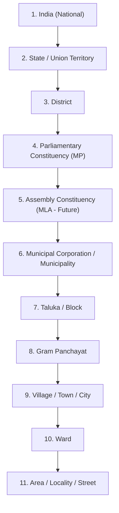
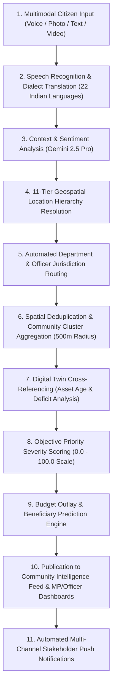

# JanSetu AI — Master Project Context & Enterprise Governance Brain
> **AI-Powered Government Digital Ecosystem & Constituency Development Intelligence Platform**
>
> **Version:** 2.0 (Enterprise Ecosystem Edition)
>
> **Document Type:** Master Project Context / Vision / Architectural Source of Truth
>
> **Note:** The enterprise documentation folder structure maintains this source of truth at both `docs/00_PROJECT_CONTEXT.md` and root `00_PROJECT_CONTEXT.md`.
>
> **Purpose:** This document is the single, authoritative source of truth for every architect, developer, AI coding agent, database engineer, and contributor working on JanSetu AI. Every design decision, code implementation, NoSQL schema, AI routing workflow, and RBAC policy must adhere to this document.

---

## 1. Executive Summary & Introduction

JanSetu AI is an enterprise-grade **Government Digital Ecosystem** and AI-powered governance platform designed to bridge the structural gap between citizens, administrative bodies, and elected representatives across India. By transforming unstructured, natural-language citizen feedback into standardized, evidence-backed development intelligence, JanSetu AI empowers participative democracy while enabling transparent, data-driven capital expenditure planning.

In traditional civic portals, citizens are burdened with understanding bureaucratic departmental hierarchies, administrative ward boundaries, and technical engineering terminology just to report public infrastructure failures. JanSetu AI reverses this paradigm: **citizens simply express what they see, experience, and need using spoken voice, text, photos, or video in any Indian language**. The platform's Artificial Intelligence engine automatically performs all technical analysis behind the scenes—identifying spatial location tiers, routing to responsible government departments, determining officer jurisdictions, calculating objective priority scores (0–100), and estimating material budgets.

Unlike legacy complaint management or ticketing systems, JanSetu AI functions as an end-to-end **Constituency Development Decision Support Platform**, a **Living Digital Twin Engine**, and a **Transparent Public Expenditure Ledger**.

---

## 2. Vision & Mission

### 2.1 Enterprise Vision
To build India's most scalable, trusted, and AI-driven Government Digital Ecosystem, operating seamlessly across all **543 Parliamentary Constituencies**, thousands of Municipal Corporations, and hundreds of thousands of Gram Panchayats. Every administrative unit in India will maintain a living Digital Twin reflecting its real-time infrastructure health, ongoing civil works, demographic coverage, budget allocation, and citizen satisfaction.

### 2.2 Core Mission
To empower citizens to actively guide the development of their neighborhoods while equipping Members of Parliament (MPs), Members of Legislative Assembly (MLAs), District Collectors, and Municipal Officers with automated, objective intelligence to execute transparent, tamper-proof public works.

---

## 3. The Core Philosophy

### 3.1 The Fundamental Law of JanSetu AI
> **"Citizens should never need to understand government departments, legal classifications, or administrative boundaries."**

When interacting with the platform, a citizen should only describe:
- **What they see** (e.g., *a collapsed bridge span or broken sewer main*).
- **What they experience** (e.g., *contaminated drinking water causing illness in children*).
- **What their community needs** (e.g., *a new primary health center or solar street lighting*).

The platform's AI and geospatial routing engines are 100% responsible for understanding everything else: mapping natural language syntax to legal budget heads, identifying the exact administrative tier (from State down to Area Locality), assigning the responsible departmental officer, and aggregating duplicate community reports into unified project proposals.

### 3.2 Product Classification
JanSetu AI is **NOT**:
- A traditional Complaint Management System (CMS) or Helpdesk.
- A grievance ticketing system where issues are closed arbitrarily without verification.
- A social media feed or political polling app.

JanSetu AI **IS**:
- A National **Government Digital Ecosystem** & Administrative Infrastructure Blueprint.
- An **AI-Powered Decision Support System (DSS)** for capital works allocation.
- A **Real-Time Constituency Digital Twin** tracking physical asset lifecycles.
- A **Participative Governance & Public Transparency Ledger**.

---

## 4. Real Government Location Hierarchy (11-Tier Architecture)

To operate nationwide, JanSetu AI implements a normalized, parent-child spatial hierarchy. Every physical location in India is assigned a globally unique identifier (`locationId`) and maintains strict referential integrity to its parent node.

### 4.1 Hierarchical Tiers & Spatial Scope
1. **India (National Tier)**: Top-level root aggregation for pan-India infrastructure analytics and PM Gati Shakti alignment.
2. **State / Union Territory**: Administered by State Admins; tracks state GDP development correlation and regional departmental budget distribution.
3. **District**: Administered by District Collectors / DMs; coordinates multi-constituency infrastructure projects and disaster management.
4. **Parliamentary Constituency (PC)**: Administered by Members of Parliament (MPs); primary unit for MPLADS budget sanctioning and macro-development intelligence.
5. **Assembly Constituency (AC - Future)**: Administered by MLAs; regional legislative oversight and MLALADS allocation.
6. **Municipal Corporation / Municipality**: Administered by Municipal Commissioners / Mayors; urban infrastructure execution and town planning.
7. **Taluka / Block**: Administered by Block Development Officers (BDOs); rural administrative grouping.
8. **Gram Panchayat**: Administered by Sarpanch / Panchayat Secretaries; grassroots rural governance and MGNREGA coordination.
9. **Village / Town / City**: Distinct settlement clusters maintaining standalone demographic and asset records.
10. **Ward**: Electoral and administrative micro-divisions within municipalities or panchayats; primary unit for field officer inspections.
11. **Area / Locality / Street**: Granular geospatial polygon or geohash cluster representing exact neighborhood blocks.

### 4.2 Parent-Child Integrity & Geospatial Routing
When a citizen reports an issue at coordinates `(25.3176° N, 83.0062° E)`, the spatial indexer automatically resolves the full 11-tier lineage (e.g., *India $\rightarrow$ Uttar Pradesh $\rightarrow$ Varanasi District $\rightarrow$ Varanasi PC $\rightarrow$ Varanasi North AC $\rightarrow$ Varanasi Municipal Corp $\rightarrow$ Block N/A $\rightarrow$ Panchayat N/A $\rightarrow$ Varanasi City $\rightarrow$ Ward 14 $\rightarrow$ Lahurabir Locality*). Data aggregated at Tier 11 rolls up dynamically to populate executive dashboards at Tiers 4, 3, 2, and 1.

---

## 5. Enterprise User Roles & RBAC Governance

The platform enforces strict Role-Based Access Control (RBAC) via cryptographically signed JWT authentication claims. Every user is bound to specific roles and administrative jurisdiction nodes.

| Role Name | Scope & Jurisdiction | Core Responsibilities & Capabilities |
| :--- | :--- | :--- |
| **1. Citizen** | Dual-Identity: Home PC (Voting) vs Physical GPS (Reporting) | Submit multimodal needs, upload evidence, upvote neighborhood projects, participate in civic surveys, and verify work completion. |
| **2. Member of Parliament (MP)** | Bound to assigned Parliamentary Constituency (Tier 4) | Review ranked AI priorities, analyze GIS deficit heatmaps, sanction MPLADS budgets, dispatch field inspection orders, and publish 5-year development plans. |
| **3. Member of Legislative Assembly (MLA)** | Bound to assigned Assembly Constituency (Tier 5 - Future) | Review assembly-level infrastructure gaps, allocate MLALADS funds, and monitor constituency project lifecycles. |
| **4. District Collector / District Admin** | Bound to assigned District (Tier 3) | Multi-constituency administrative oversight, inter-departmental conflict resolution, emergency disaster response, and district budget auditing. |
| **5. State Admin** | Bound to assigned State / UT (Tier 2) | Monitor state-wide development index, allocate state budget grants, audit municipal performance, and manage state departmental heads. |
| **6. National Admin** | Pan-India (Tier 1) | Oversee national infrastructure connectivity, monitor cross-state corridor projects, and integrate federal datasets (Census, NHAI, Ministry of Urban Development). |
| **7. Super Admin** | System-Wide Technical Scope | Platform infrastructure management, cloud scaling, Firestore security rule administration, AI prompt engineering, and master dataset ingestion. |
| **8. Government Department Head** | Bound to specific Department + State/District Scope | Allocate departmental resources, set service level agreements (SLAs), review departmental workload analytics, and assign senior engineers. |
| **9. Government Officer** | Bound to specific Department + Ward/Block Jurisdiction (Tier 7–10) | Conduct GPS-geofenced physical site inspections, upload geotechnical verification reports, issue completion certificates, and authorize contractor billing milestones. |
| **10. Contractor** | Bound to awarded Project IDs | Accept contract awards, upload raw material specifications, log milestone completion photos with EXIF timestamps, and submit verifiable invoices. |
| **11. Auditor** | Read-Only Scope across assigned District/State/National Tier | Conduct independent financial and engineering audits, review immutable blockchain audit trails, and flag budget discrepancies or tender anomalies. |
| **12. Moderator** | System-Wide Content Scope | Monitor community feeds, review AI flagging logs, filter hate speech/spam, and enforce public discourse guidelines. |

---

## 6. Government Departments & AI Routing Taxonomy

Rather than routing complaints to generic pools, every Development Need is categorized by Google Gemini into one or more of **21+ specialized Government Departments**. The AI identifies the primary domain and secondary subcategories instantly.

1. **Roads & Highways**: Pothole repairs, highway resurfacing, bridge maintenance, flyover construction, road signage.
2. **Water Supply**: Potable water pipeline leaks, municipal storage tank construction, contamination testing, tube-well drilling.
3. **Electricity**: Transformer replacements, overhead grid wiring repairs, street lighting installation, substation capacity upgrades.
4. **Drainage & Sewerage**: Open drain covering, storm-water line desilting, sewage treatment plant (STP) maintenance, manhole repairs.
5. **Education**: Primary school building repairs, digital classroom infrastructure, sanitation facilities in schools, playground maintenance.
6. **Healthcare**: Primary Health Center (PHC) equipment upgrades, medicine stock monitoring, ambulance road access, maternal care clinics.
7. **Public Transport**: Bus shelter construction, municipal bus routing needs, e-rickshaw charging stations, metro feeder connectivity.
8. **Agriculture**: Farm irrigation canal maintenance, soil testing laboratory access, grain storage godown construction, fertilizer distribution points.
9. **Environment & Forestry**: Urban afforestation, lake desilting, industrial pollution reporting, public park development, biodiversity conservation.
10. **Women & Child Development**: Anganwadi center infrastructure, maternal nutrition centers, working women hostels, childcare facilities.
11. **Digital Infrastructure**: Public Wi-Fi hotspots, optical fiber cable (OFC) laying, common service center (CSC) upgrades, rural digital literacy centers.
12. **Smart City**: IoT traffic signal synchronization, automated waste sensors, integrated command and control center (ICCC) feeds, smart parking.
13. **Disaster Management**: Flood protection walls, cyclone shelter maintenance, emergency evacuation road clearing, fire hydrant installations.
14. **Sports & Youth Affairs**: Rural stadium construction, public gymnasium equipment, sports training facilities, playground leveling.
15. **Tourism & Culture**: Heritage site restoration, tourist sanitation complexes, approach road beautification, pilgrim facility upgrades.
16. **Skill Development**: Vocational training center construction, industrial training institute (ITI) lab upgrades, youth employment hubs.
17. **Public Safety & Police**: CCTV camera surveillance grids, police booth construction, dark alley lighting, pedestrian safety guardrails.
18. **Waste Management**: Solid waste dumping remediation, door-to-door garbage collection routing, landfill bio-mining, public toilet complexes.
19. **Urban Development**: Town planning zoning compliance, slum redevelopment projects, vending zone construction, public parking plazas.
20. **Rural Development**: MGNREGA asset creation, Pradhan Mantri Awas Yojana (PMAY) housing infrastructure, rural link roads (PMGSY), panchayat ghars.
21. **Public Facilities & Civic Administration**: Community halls, crematorium and burial ground maintenance, public library construction, municipal market complexes.

---

## 7. Project Ownership Lifecycle & Tamper-Proof Audit Trail

When an MP or District Collector sanctions a Development Need, it transforms into an institutional **Project**. Every project document maintains 20 mandatory tracking fields to guarantee absolute transparency and accountability.

### 7.1 Mandatory Project Tracking Attributes
1. **`projectId`**: Globally unique alphanumeric identifier (e.g., `PRJ-GUJ-SRT-2026-0891`).
2. **`projectName`**: Formal AI-generated engineering title (e.g., *Construction of 500kL RCC Overhead Potable Water Storage Tank in Ward 12*).
3. **`department`**: Primary departmental taxonomy code (e.g., `DEPT_WATER_SUPPLY`).
4. **`responsibleOfficer`**: Embedded profile reference of the assigned municipal engineer (`officerId`, name, designation, phone, ward jurisdiction).
5. **`assignedContractor`**: Embedded profile reference of the awarded construction firm (`contractorId`, company name, license grade, GSTIN).
6. **`fundingSource`**: Financial budget head (e.g., `MPLADS_2026_27`, `STATE_FINANCE_COMMISSION`, `AMRUT_2.0`, `MUNICIPAL_GENERAL_FUND`).
7. **`budgetINR`**: Total sanctioned financial outlay in Indian Rupees (e.g., `4500000.00`).
8. **`startDate`**: Formal contractual commencement timestamp.
9. **`estimatedCompletionDate`**: Contractual SLA target completion timestamp.
10. **`currentStatus`**: Lifecycle state enum (`SANCTIONED`, `TENDER_FLOATED`, `AWARDED`, `IN_PROGRESS`, `MILESTONE_VERIFIED`, `COMPLETED`, `UNDER_MAINTENANCE`, `AUDITED`).
11. **`milestones`**: Array of structured engineering checkpoints (e.g., *1. Foundation Excavation (20%), 2. RCC Column Raising (50%), 3. Pipeline Interconnection (80%), 4. Final Hydro-Testing (100%)*).
12. **`progressPercentage`**: Real-time integer progression (0–100) tied directly to officer-verified milestones.
13. **`citizenSatisfactionScore`**: Aggregated post-completion community rating (1.0 to 5.0 stars) derived from verified resident surveys.
14. **`maintenancePeriodMonths`**: Mandatory defect liability period (e.g., `36` months) where contractor is legally bound to repair damages.
15. **`completionCertificate`**: Cryptographically signed digital certificate issued by the Executive Engineer upon final successful inspection.
16. **`inspectionReports`**: Array of formal inspection documents containing geotechnical observations, concrete cube test results, and site notes.
17. **`photos`**: Geotagged, timestamped before-and-after visual evidence stored in Firebase Storage with SHA-256 hash verification.
18. **`documents`**: PDF repositories containing tender notices, work orders, architectural blueprints, and material invoices.
19. **`gpsBoundary`**: GeoJSON Polygon or MultiPolygon defining the physical footprint of the civil project on Google Maps.
20. **`auditTrail`**: Append-only cryptographic ledger tracking every status mutation, budget disbursement, and officer sign-off with actor IP and timestamp.

---

## 8. Government Officer Types & Jurisdiction Isolation

To prevent administrative chaos and fraudulent remote approvals, JanSetu AI categorizes government officers into specialized engineering domains and enforces strict spatial jurisdiction fences.

### 8.1 Specialized Officer Classifications
- **Road & Highway Engineer**: Civil engineers specializing in asphalt/concrete paving, grading, and bridge structural integrity.
- **Water Supply & Hydraulics Engineer**: Engineers managing pumping stations, pipeline hydraulic pressure, and water treatment plants.
- **Electrical & Grid Officer**: Electrical engineers overseeing distribution transformers, HT/LT lines, and street lighting grids.
- **Public Health & Medical Officer**: Health administrative officials supervising PHCs, municipal dispensaries, and epidemiological sanitation.
- **Education Infrastructure Officer**: Officials responsible for school building safety, classroom ergonomics, and campus sanitation.
- **Municipal Executive Officer (Chief Officer)**: Overall administrative head of a municipality responsible for cross-departmental execution.
- **Village Development Officer (VDO / Gram Sevak)**: Grassroots administrative officers managing village panchayat development works.
- **Taluka / Block Development Officer (BDO)**: Officers coordinating rural development schemes across multiple gram panchayats.
- **District Executive Engineer (PWD/CPWD)**: Senior engineering authority supervising large-scale capital works across district corridors.

### 8.2 Strict Jurisdiction Isolation Rules
1. **Geographic Isolation**: An officer assigned to **Ward 14, Surat Municipal Corporation** can view, inspect, and verify ONLY projects located within the spatial polygon of Ward 14. Projects in Ward 15 remain completely hidden from their action queue.
2. **Departmental Isolation**: A **Water Supply Engineer** cannot verify or issue completion certificates for a **Road Resurfacing** project, even if both projects occur within their assigned ward.
3. **GPS Geofence Shutter Lock**: When an officer visits a project site to submit an inspection report, the mobile application checks their physical GPS coordinates. If the officer is not within **50 meters** of the project's `gpsBoundary`, the camera shutter button and report submission forms are programmatically locked.

---

## 9. Universal Digital Twin Engine (18+ Parameter Architecture)

JanSetu AI transitions governance from reactive complaint resolution to predictive infrastructure management through the **Constituency Digital Twin Engine**. Every village, municipal ward, and town maintains a dynamic document in Cloud Firestore (`/digital_twins/{locationId}`) continuously aggregating 18 core intelligence parameters.

| Parameter Name | Data Type & Source | Architectural Purpose & AI Utilization |
| :--- | :--- | :--- |
| **1. Population Demographics** | Total count, age/gender breakdown (Census / Aadhaar integration) | Enables AI to calculate per-capita infrastructure deficits and predict beneficiary counts for proposed projects. |
| **2. Road Network & Quality** | Total km length, asphalt vs concrete ratio, average pothole density | Identifies arterial corridors requiring preventive resurfacing before monsoon degradation occurs. |
| **3. Primary & Secondary Schools** | Asset count, student-to-classroom ratio, functional toilet % | Highlights education deficits; AI flags wards where school commute times exceed national benchmarks. |
| **4. Government Colleges & ITIs** | Higher education facilities, enrollment capacity, lab health | Guides MPs in directing youth skill development funds to underserved rural blocks. |
| **5. Public Hospitals & PHCs** | Bed capacity, doctor-to-patient ratio, functional ambulance count | Critical healthcare indexing; AI prioritizes road repair requests leading to emergency trauma centers. |
| **6. Anganwadi Centers** | Center count, child nutrition tracking index, building structural health | Monitors grassroots maternal and early childhood development infrastructure. |
| **7. Municipal Water Tanks** | Storage capacity in kiloliters (kL), daily supply hours, pipeline age | Prevents water scarcity crises by correlating tank age with citizen leakage grievance velocity. |
| **8. Drainage & Sewerage Network** | Covered vs open drain length (km), desilting frequency logs | Predicts urban flood risks during heavy rainfall; guides storm-water drain capital allocation. |
| **9. Electricity Infrastructure** | Transformer count, average daily power outage minutes, solar % | Maps energy reliability; identifies overloaded transformers requiring immediate capacity upgrades. |
| **10. Internet & OFC Coverage** | Optical fiber reach (km), 4G/5G tower density, public Wi-Fi nodes | Measures digital divide; assists in prioritizing BharatNet fiber laying in rural panchayats. |
| **11. Public & Government Buildings** | Panchayat ghars, community halls, municipal offices structural rating | Tracks civic administrative asset health and schedules periodic structural audits. |
| **12. Government Land & Asset Registry** | Geotagged public land parcels, encroachment status, market value | Prevents illegal encroachment and identifies vacant municipal land for new parks or hospitals. |
| **13. Allocated Ward Budget** | Annual financial allocation across all schemes (INR), expenditure % | Prevents fund lapsing; alerts MPs and DMs when departmental budgets remain underutilized. |
| **14. Ongoing Civil Projects** | Count of active projects, total financial outlay, average delay days | Provides real-time execution visibility; flags contractors habitually failing milestone deadlines. |
| **15. Completed Project Archives** | Total completed works over 10 years, historical capital expenditure | Builds longitudinal development history; prevents redundant spending on recently upgraded assets. |
| **16. Maintenance & Warranty Logs** | Active warranty timelines, contractor defect liability tracking | AI automatically alerts municipal engineers to inspect roads 60 days before contractor warranties expire. |
| **17. AI Development Score** | Dynamic 0–100 composite index calculated algorithmically | Objective metric comparing development progress across all 543 parliamentary constituencies. |
| **18. Citizen Satisfaction Score** | Longitudinal resident rating (1.0–5.0) derived from post-project polls | Direct democratic feedback loop measuring real-world public approval of executed governance. |
| **19. Infrastructure Score** | Physical asset structural health composite index (0–100) | Identifies decaying wards requiring emergency capital intervention. |
| **20. Environmental & Green Score** | Green cover %, air quality index (AQI) averages, waste clearance % | Aligns local ward development with national sustainability and clean air targets. |

---

## 10. Automated AI Routing & Processing Pipeline

When a citizen submits a multimodal grievance or development proposal, it enters an automated, 11-stage reasoning pipeline powered by **Google Gemini 2.5 Pro** and Firebase Cloud Functions. The citizen performs zero manual routing.

### 10.1 Pipeline Stage Breakdowns
1. **Multimodal Ingestion**: Accepts raw voice recordings (MP3/AAC), geotagged JPEG/PNG photos, MP4 videos, and scanned PDF documents.
2. **Speech Recognition & Translation**: Directly processes colloquial regional dialects (e.g., *Kathiawadi Gujarati, Bhojpuri, Maithili, Marwari*) and translates into standardized executive English while preserving local landmark names.
3. **Context Understanding**: Analyzes underlying civic intent, strips emotional repetition, filtering out political hate speech, spam, or private disputes.
4. **Location Resolution**: Uses EXIF GPS coordinates and reverse geocoding to map the issue precisely to its Tier 11 (Locality), Tier 10 (Ward), Tier 6 (Municipality), and Tier 4 (PC) identifiers.
5. **Department & Officer Routing**: Matches the civic domain to one of the 21+ departments and binds the ticket directly to the specific officer whose jurisdiction polygon encapsulates the coordinate.
6. **Spatial Deduplication**: Queries Firestore spatial indices within a **500-meter radius**. If an identical issue (e.g., *same burst water main*) already exists, the new report is merged as a community upvote and witness photo, boosting the primary report's priority.
7. **Digital Twin Cross-Referencing**: Reads the ward's Digital Twin (`/digital_twins/{wardId}`). If a reported broken road was resurfaced only 4 months ago, the AI flags a **Contractor Warranty Violation** and routes an alert directly to the District Auditor and Executive Engineer.
8. **Objective Priority Scoring (0–100)**: Evaluates hazard severity (e.g., *open high-voltage wire near school = 95 pts; cosmetic wall peeling = 12 pts*), population density impact, and community upvote velocity to assign a tamper-proof priority score.
9. **Budget & Impact Prediction**: Estimates required construction materials and financial outlay based on historical state PWD schedule of rates (SoR), predicting exact household beneficiary counts.
10. **Dashboard Publication**: Renders the formatted engineering title, 30-word executive summary, and severity badge onto the MP Decision Dashboard and Officer Verification Queue.
11. **Stakeholder Notifications**: Dispatches SMS, WhatsApp, and push notifications to the citizen ("*Your report has been routed to Executive Engineer R. Patel, Water Supply Dept*"), local residents, and the MP.

---

## 11. Coding & Architectural Philosophy

Every architect and engineer contributing to JanSetu AI must rigorously enforce the following standards:

1. **Never Write Demo or Stub Code**: Every function, repository, state notifier, and database query must be production-ready, handling edge cases, timeouts, and concurrent mutations.
2. **Never Hardcode Administrative or Taxonomy Values**: All departments, location hierarchies, user roles, and priority weights must be dynamically structured from Firestore configuration collections or strict TypeScript enums.
3. **Never Compromise Scalability**: Database queries must avoid unbounded full-collection scans. Always use indexed pagination (`limit()`, `startAfter()`) and geohash spatial bounding boxes.
4. **Strict SOLID & Clean Architecture Principles**: Maintain absolute separation between Presentation (UI/Widgets), Domain (Use Cases/Entities), and Data (Repositories/Data Sources).
5. **Mandatory 5-State UI Handling**: Every single screen, component, and dashboard card across mobile and web must explicitly implement and render:
   - **Loading State** (Skeletons / Shimmer effects; never spinning dead locks).
   - **Error State** (User-friendly error messages with retry actions and technical error code reporting).
   - **Empty State** (Illustrative, actionable empty views guiding the user on what to do next).
   - **Success State** (Crisp visual confirmation with animated transitions and feedback).
   - **Offline State** (Clear indication of SQLite/Hive local cache rendering and pending cloud sync badges).

---

## 12. Master Enterprise Documentation Suite

All detailed architectural specifications, functional product requirements, NoSQL schemas, RBAC rules, synthetic data generators, and future integration blueprints are organized in the `docs/` folder:

| Document Path | Title & Description |
| :--- | :--- |
| **[docs/01_PRODUCT_REQUIREMENTS.md](file:///c:/Users/patel/AndroidStudioProjects/JanSetu_Ai/docs/01_PRODUCT_REQUIREMENTS.md)** | **Complete Product Requirements (PRD)**: 9 specialized stakeholder dashboards, 14-stage project lifecycle, 10 analytical dimensions. |
| **[docs/02_ARCHITECTURE_AND_SYSTEM_DESIGN.md](file:///c:/Users/patel/AndroidStudioProjects/JanSetu_Ai/docs/02_ARCHITECTURE_AND_SYSTEM_DESIGN.md)** | **System Architecture & AI Routing Blueprint**: Gemini 2.5 Pro automated routing algorithm, Mermaid diagrams, Riverpod MVVM offline sync. |
| **[docs/03_FIRESTORE_DATABASE_SCHEMA.md](file:///c:/Users/patel/AndroidStudioProjects/JanSetu_Ai/docs/03_FIRESTORE_DATABASE_SCHEMA.md)** | **Scalable NoSQL Firestore Schema**: Normalized schemas for `/locations`, `/users`, `/departments`, `/needs`, `/projects`, `/assets`, `/digital_twins`, and `/audit_logs`. |
| **[docs/04_RBAC_AND_GOVERNANCE_MODEL.md](file:///c:/Users/patel/AndroidStudioProjects/JanSetu_Ai/docs/04_RBAC_AND_GOVERNANCE_MODEL.md)** | **RBAC & Governance Security Model**: 12-role permission matrix, horizontal/vertical officer isolation, 50m hardware GPS shutter lock, and `firestore.rules`. |
| **[docs/05_DUMMY_DATA_GENERATION_SPEC.md](file:///c:/Users/patel/AndroidStudioProjects/JanSetu_Ai/docs/05_DUMMY_DATA_GENERATION_SPEC.md)** | **Realistic Gujarat Dummy Data Spec**: Seeding architecture for State: Gujarat across 5 districts, 5 PCs, 50 villages, 500 citizens, 300 needs, and 75 projects. |
| **[docs/06_FUTURE_INTEGRATIONS_ROADMAP.md](file:///c:/Users/patel/AndroidStudioProjects/JanSetu_Ai/docs/06_FUTURE_INTEGRATIONS_ROADMAP.md)** | **Future Integrations Roadmap**: Architectural blueprints for PM Gati Shakti, Bharat Maps GIS, IoT sensors, orbital drone surveys, and AI predictive maintenance. |
| **[docs/07_MASTER_DATA_MODEL_AND_DATABASE_ARCHITECTURE.md](file:///c:/Users/patel/AndroidStudioProjects/JanSetu_Ai/docs/07_MASTER_DATA_MODEL_AND_DATABASE_ARCHITECTURE.md)** | **Master Data Model & Database Architecture**: The definitive NoSQL data architecture covering all 44+ entities, 16 AI engine models, ERDs, and zero-trust security. |
| **[docs/08_UI_UX_AND_PRODUCT_BLUEPRINT.md](file:///c:/Users/patel/AndroidStudioProjects/JanSetu_Ai/docs/08_UI_UX_AND_PRODUCT_BLUEPRINT.md)** | **UI/UX & Product Blueprint Architecture**: Definitive UI/UX source of truth across all 4 apps, featuring Material 3 tokens, 30+ Citizen App wireframes, MP/Admin workspaces, 20+ components, and 10-state UX rules. |
| **[docs/09_PRODUCT_REDESIGN_AND_COMPLETE_USER_FLOW.md](file:///c:/Users/patel/AndroidStudioProjects/JanSetu_Ai/docs/09_PRODUCT_REDESIGN_AND_COMPLETE_USER_FLOW.md)** | **Role-Driven Authentication Portal & Automated Routing Architecture**: Defines the unified zero-trust login portal, dynamic role detection, auto-workspace mounting, and hidden hackathon dev-mode persona switcher. |

---

## 13. The Ultimate Destination

JanSetu AI is engineered to become the permanent digital backbone of Indian democratic governance. By embedding Artificial Intelligence into the grassroots administrative hierarchy, the platform eliminates bureaucratic inertia, eradicates political bias in capital allocation, and builds an immutable bridge of trust between the 1.4 billion citizens of India and their elected leaders. **Every line of code, database index, and architectural model must serve this national mission.**