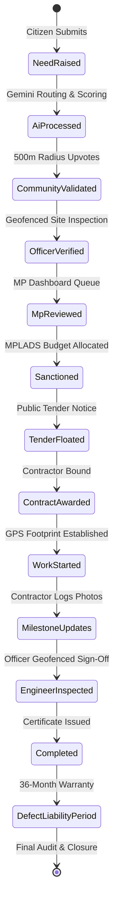

# JanSetu AI — Complete Enterprise Product Requirements & Functional Specifications
> **AI-Powered Government Digital Ecosystem & Constituency Development Intelligence Platform**
>
> **Version:** 2.0 (Enterprise Ecosystem Edition)
>
> **Document Type:** Comprehensive Product Requirements Document (PRD) & Functional Specification Blueprint
>
> **Note:** The enterprise documentation folder structure maintains this specification at both `docs/01_PRODUCT_REQUIREMENTS.md` and root `01_PRODUCT_REQUIREMENTS.md`.
>
> **Purpose:** This document specifies every mandatory module, workflow, stakeholder dashboard, project lifecycle phase, analytical metric, security control, and offline-first requirement for JanSetu AI. All engineering implementations must satisfy these specifications.

---

## 1. Product Scope & Architectural Foundations

JanSetu AI transforms civic participation into institutional capital infrastructure execution. The platform is structured around three foundational pillars:
1. **Multimodal Citizen Intake**: Zero-barrier submission of development proposals using voice, images, video, and text across 22 scheduled Indian languages.
2. **Automated AI Routing & Prioritization**: Real-time resolution of spatial hierarchy (11 tiers), departmental taxonomy (21+ departments), and objective priority scoring (0–100) via Google Gemini 2.5 Pro.
3. **Transparent Public Works Execution**: Cryptographically verifiable project tracking from initial budget sanction through contractor tender, geofenced milestone inspections, and 3-year defect liability warranty periods.

---

## 2. Specialized Stakeholder Dashboards (9 Enterprise Portals)

To support the real government hierarchy and RBAC roles, JanSetu AI provides 9 purpose-built, isolated dashboard interfaces.

### 2.1 Citizen Application & Development Portal
The public entry point for 1.4 billion citizens across India, accessible via mobile (Flutter iOS/Android) and progressive web app (PWA).

#### Mandatory Functional Capabilities
- **Aadhaar / Mobile OTP Authentication**: Secure login with cryptographic binding to verified home constituency (Tier 4 PC and Tier 10 Ward).
- **Dual-Identity Spatial Binding**: Enforces rules distinguishing verified voting residency from physical GPS reporting location.
- **Multimodal Need Submission Workflow**:
  - **Voice Intake**: One-tap recording with automatic silence trimming and background noise suppression.
  - **Visual Intake**: Multi-photo and video upload with mandatory EXIF GPS geolocation extraction.
  - **Document Intake**: Scanned PDF upload for community petitions or historical public requests.
- **AI Confirmation Screen**: Presents the citizen with the AI-translated executive summary, detected category, and inferred location before final cloud commit.
- **Community Upvoting & Witnessing**: Citizens within a 500-meter radius receive alerts to upvote or add corroborating photos to existing community reports, preventing duplicate administrative ticket creation.
- **Project Lifecycle Tracking**: Public visibility into sanctioned project budgets, contractor company details, milestone completion photos, and expected completion dates.
- **MP Proposal Voting**: Participative democratic polling where citizens vote on annual MPLADS expenditure priorities proposed by their MP.
- **Post-Completion Satisfaction Survey**: 1-to-5 star rating and feedback submission once a civil project is marked completed by the Executive Engineer.

---

### 2.2 Member of Parliament (MP) Decision Dashboard
Designed for elected MPs to manage their Parliamentary Constituency (Tier 4) and allocate Members of Parliament Local Area Development Scheme (MPLADS) funds.

#### Mandatory Functional Capabilities
- **Constituency Executive Overview**: Real-time aggregated metrics showing total reported needs, active civil projects, total MPLADS budget utilized vs remaining, and average contractor delay days across all assembly segments.
- **AI Priority Ranking Matrix**: Sorts all constituency demands by objective severity score (0–100), highlighting critical school, healthcare, and water supply deficits.
- **Interactive GIS Heatmap**: Layered map visualization overlaying civic grievance clusters, demographic density, and existing government assets.
- **MPLADS Budget Sanctioning Workflow**: One-click project approval generating a formal electronic work order (`projectId`), binding a financial outlay, and dispatching orders to the District Collector and Municipal Chief Officer.
- **Officer & Contractor Accountability Queue**: Live tracking of department heads and contractors failing SLA inspection timelines.
- **5-Year Development Plan Publisher**: Tool to publish annual vision blueprints and solicit structured community feedback.

---

### 2.3 Member of Legislative Assembly (MLA) Dashboard (Future Architecture)
Designed for MLAs to manage Assembly Constituency (Tier 5) capital works and MLALADS budget grants.

#### Mandatory Functional Capabilities
- **Assembly Segment Filtering**: Granular view of wards and panchayats falling within the assembly constituency boundary.
- **MLALADS Capital Allocation**: Coordinated project sanctioning workflow preventing overlap with MP-funded works.
- **Panchayat & Block Coordination**: Direct communication channel with Block Development Officers (BDOs) and Sarpanchs.

---

### 2.4 District Collector / District Magistrate (DM) Admin Portal
The primary administrative oversight dashboard for District Collectors managing multi-constituency infrastructure (Tier 3).

#### Mandatory Functional Capabilities
- **Inter-Departmental Coordination Grid**: Unified matrix tracking execution speed across PWD, Water Supply, Electricity, and Health departments within the district.
- **Disaster Management & Emergency Override**: Instant broadcast capability to reroute earthmovers, ambulances, and water tankers during floods, cyclones, or industrial accidents.
- **Tender & Procurement Audit Ledger**: Oversight of contractor tender bidding, licensing grades, and blacklisting registries.
- **Magisterial Verification Dispatch**: Ability to order independent magisterial or third-party engineering audits on flagged or stalled civil works.

---

### 2.5 Government Department Head Dashboard
Designed for Chief Engineers and Directors of the 21+ specialized departments at the State and District levels.

#### Mandatory Functional Capabilities
- **Departmental Workload & SLA Monitor**: Live tracking of open needs, average officer verification time, and SLA breach warnings across all municipal wards.
- **Resource & Capital Allocation**: Distribution of annual departmental budget grants across subordinate engineering divisions.
- **Senior Engineer Assignment**: Automated and manual re-routing of complex geotechnical or structural issues to specialized executive engineers.
- **Contractor Performance Index**: Department-wide rating registry evaluating construction firms on build quality, adherence to IS codes, and timeline compliance.

---

### 2.6 Government Field Officer Verification Dashboard
A mobile-first, offline-capable interface for junior engineers, inspectors, and municipal officers operating at Wards and Blocks (Tiers 7–10).

#### Mandatory Functional Capabilities
- **Jurisdiction-Isolated Action Queue**: Displays ONLY grievances and project milestones falling within the officer's assigned geographic geofence and departmental domain.
- **GPS-Geofenced Site Inspection Workflow**:
  - Enforces physical presence: mobile camera shutter and form submission are programmatically disabled unless the officer is within **50 meters** of the target asset GPS boundary.
  - Geotechnical and Structural Form Fill: Standardized checklists for concrete slump tests, pipe burst pressure ratings, and electrical earth resistance.
- **Milestone Billing Sign-Off**: Cryptographic authorization of contractor milestone completion, releasing financial payment tranches.
- **Digital Completion Certificate Issuance**: Generation of tamper-proof completion certificates triggering the 3-year contractor defect liability period.

---

### 2.7 Contractor Execution & Billing Portal
Designed for awarded construction firms and civil contractors to log physical execution progress.

#### Mandatory Functional Capabilities
- **Contract Work Order Repository**: Access to approved architectural blueprints, PWD schedule of rates (SoR), and environmental compliance stipulations.
- **Milestone Progress Logging**: Step-by-step submission of construction checkpoints (e.g., Foundation, Plinth, Superstructure, Finishing).
- **Geotagged Proof Upload**: Upload of raw, unedited site photographs containing immutable EXIF GPS and timestamp metadata.
- **Verifiable Invoice & Bill Submission**: Digital submission of material GST invoices and labor muster rolls for executive engineer sign-off.
- **Warranty Maintenance Tracker**: Dashboard tracking defect notifications received during the 36-month post-completion liability period.

---

### 2.8 State & National Executive Dashboards
Macro-governance portals for Chief Ministers, State Chief Secretaries, and Prime Minister's Office (PMO) / NITI Aayog officials (Tiers 1–2).

#### Mandatory Functional Capabilities
- **National / State Development Index**: Comparative benchmarking of districts and constituencies using the algorithmic AI Development Score (0–100).
- **PM Gati Shakti & National Scheme Alignment**: Overlay of national highway, railway, and optical fiber grids with local constituency civic demands.
- **Macro Infrastructure Deficit Heatmaps**: Instant identification of underserved rural corridors lacking primary schools, PHCs, or all-weather road connectivity.
- **Capital Expenditure (CapEx) Utilization Tracking**: Real-time monitoring of state and central fund disbursement vs ground-level asset creation.

---

### 2.9 Super Admin, Auditor & Moderator Portal
System-wide management interface for technical administrators, independent auditors, and content moderators.

#### Mandatory Functional Capabilities
- **AI Model Performance & Hallucination Logging**: Monitoring Google Gemini classification accuracy, latency, and fallback rates.
- **RBAC & Jurisdiction Mapping Engine**: Dynamic binding of user IDs to administrative tiers, departmental taxonomies, and spatial geofences.
- **Immutable Blockchain Audit Ledger**: Read-only access for auditors to trace timestamped logs of every financial transaction, approval sign-off, and status mutation.
- **Community Discourse Moderation**: AI-assisted flagging and review queue for removing hate speech, spam, or PII violations from community feeds.

---

## 3. End-to-End Project Ownership & Lifecycle Specifications

Every capital project sanctioned within JanSetu AI transitions through 14 rigid, auditable lifecycle states.

### 3.1 Strict Lifecycle State Definitions
1. **`NEED_RAISED`**: Raw citizen submission ingested into `/needs` collection.
2. **`AI_PROCESSED`**: Gemini 2.5 Pro has completed speech translation, category taxonomy classification, location resolution, and priority scoring.
3. **`COMMUNITY_VALIDATED`**: Local residents within 500m have corroborated the issue via upvotes or witness images.
4. **`OFFICER_VERIFIED`**: Junior Engineer has physically visited the site within a 50m geofence and confirmed engineering validity.
5. **`MP_REVIEWED`**: MP has evaluated the verified report on their Decision Dashboard.
6. **`SANCTIONED`**: MP or DM has authorized capital expenditure, creating an immutable `/projects` document with an assigned budget head.
7. **`TENDER_FLOATED`**: Public procurement notice published to registered contractor pools.
8. **`CONTRACT_AWARDED`**: Contractor ID, company GSTIN, and SLA deadlines legally bound to the project document.
9. **`WORK_STARTED`**: Contractor logs site mobilization; physical GPS polygon boundary finalized on Google Maps.
10. **`MILESTONE_UPDATES`**: Contractor logs incremental physical progress (20%, 40%, 60%, 80%) with timestamped visual proof.
11. **`ENGINEER_INSPECTED`**: Executive Engineer conducts geofenced physical verification of completed milestone tranches before authorizing financial disbursement.
12. **`COMPLETED`**: Final engineering inspection passed; Executive Engineer signs digital Completion Certificate.
13. **`DEFECT_LIABILITY_PERIOD`**: Mandatory 36-month maintenance window. Any structural defects reported by citizens trigger automated contractor penalty warnings.
14. **`AUDITED_AND_CLOSED`**: Independent Auditor verifies financial ledgers and physical asset durability; project archived into location Digital Twin.

---

## 4. Enterprise Analytics & 10-Dimensional Intelligence Architecture

The platform's analytical engine aggregates data across 10 distinct dimensions to empower executive decision-making.

1. **Geospatial Deficit Heatmaps**: Density clustering of infrastructure failures across 21 departments, identifying chronic breakdown zones.
2. **Departmental Performance & SLA Benchmarking**: Comparative speed analysis measuring average hours from citizen report to officer verification across departments.
3. **Budget Utilization & Fund Lapsation Velocity**: Real-time tracking of allocated vs disbursed capital expenditure across MPLADS, MLALADS, and municipal grants.
4. **Citizen Satisfaction Correlation Index**: Correlating post-completion public survey ratings (1–5 stars) against specific contractors and executive engineers.
5. **Project Delay & Contractor Fault Analysis**: Identifying contractors habitually breaching estimated completion dates across multiple wards.
6. **Departmental Workload & Engineering Deficits**: Mapping open ticket volume against available field officer headcount to highlight staffing shortages.
7. **Infrastructure Gap Analysis**: AI cross-referencing Census demographic data against physical asset counts (e.g., *Ward 12 has 15,000 residents but zero maternity clinics*).
8. **Demographic Coverage & Inclusivity Metrics**: Measuring platform participation across gender, age groups, and vernacular dialect preferences.
9. **Universal Development Score Trends**: Longitudinal tracking of the 0–100 algorithmic score across months, quarters, and 5-year parliamentary terms.
10. **AI Recommendation Acceptance Velocity**: Tracking the percentage of AI-generated capital expenditure proposals approved by MPs without modification.

---

## 5. Security, RBAC & Offline-First Technical Requirements

### 5.1 Strict Access & Governance Security
- **Multi-Factor OTP & Aadhaar Binding**: Enforced for all administrative and officer role transitions.
- **Custom JWT Auth Claims**: Firebase Auth tokens must embed `{ role, departmentId, jurisdictionLocationId, clearanceLevel }`.
- **Zero-Trust Firestore Security Rules**: All database read/write operations must be server-side validated against JWT claims and spatial polygon bounds.
- **Automated Spam & Bot Suppression**: Cloud Functions rate-limit submissions and leverage Gemini NLP to identify automated script attacks or duplicate flooding.

### 5.2 Offline-First Edge Architecture
To function reliably in remote rural panchayats with intermittent 4G/optical fiber connectivity:
- **Local SQLite / Hive Persistence**: Citizen apps and Field Officer verification portals must cache the local ward feed, digital twin summaries, and pending inspection forms locally.
- **Asynchronous Background Sync**: Inspection reports, EXIF-tagged photos, and citizen grievances created offline are queued in a persistent local background job queue and synced automatically when network connectivity is restored.
- **Conflict Resolution**: Timestamp-based optimistic concurrency control with server-side authoritative validation for financial milestones.

---

## 6. Production Acceptance Criteria

The JanSetu AI platform will be deemed enterprise-ready when:
1. **Intake Speed**: An uneducated citizen can record a 15-second voice grievance in regional dialect and receive an AI-formatted English proposal in under **45 seconds**.
2. **Routing Accuracy**: Google Gemini achieves $\ge 98.5\%$ accuracy in routing reports to the correct department and spatial jurisdiction tier.
3. **Deduplication Efficiency**: Community cluster aggregation reduces administrative duplicate ticket volume by at least **85%**.
4. **Geofenced Enforcement**: ZERO inspection reports or completion certificates can be submitted from outside the mandatory 50-meter GPS asset perimeter.
5. **Audit Transparency**: 100% of budget allocations, officer verifications, and milestone payments generate immutable, timestamped cryptographic logs.