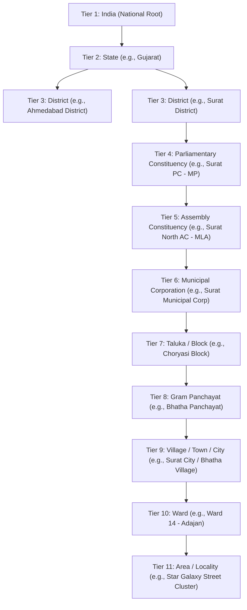
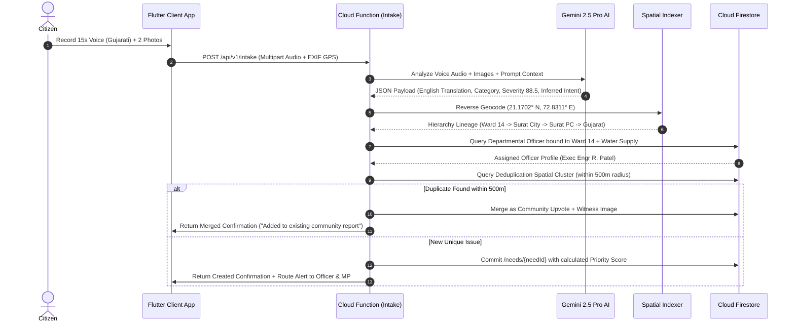
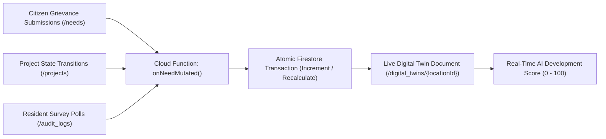
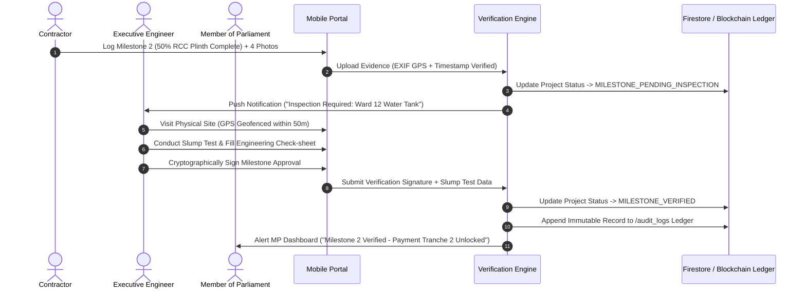

# JanSetu AI — Enterprise System Architecture & AI Routing Blueprint
> **AI-Powered Government Digital Ecosystem & Constituency Development Intelligence Platform**
>
> **Version:** 2.0 (Enterprise Ecosystem Edition)
>
> **Document Type:** System Architecture & Technical Design Blueprint
>
> **Purpose:** This document specifies the high-level system architecture, automated Google Gemini AI routing algorithms, Universal Digital Twin aggregation engine, offline-first synchronization protocols, and clean architectural design patterns for JanSetu AI.

---

## 1. Enterprise High-Level Architecture

JanSetu AI is designed as a cloud-native, serverless, offline-first distributed system deployed on Google Cloud Platform (GCP) and Firebase. The architecture enforces strict decoupling between client applications, edge APIs, AI inference engines, and persistent NoSQL storage.

```mermaid
graph TD
    subgraph Client Layer ["1. Multi-Platform Client Applications"]
        CA["Citizen Flutter App (iOS / Android / PWA)"]
        FA["Field Officer App (Offline-First GPS Geofenced)"]
        WD["Web Executive Dashboards (Next.js 15 / React - MP, Collector, Admin)"]
    end

    subgraph Edge & Gateway Layer ["2. API Gateway & Edge Layer"]
        AUTH["Firebase Authentication & Custom JWT RBAC Claims"]
        FCM["Firebase Cloud Messaging (Push / SMS / WhatsApp)"]
        CDN["Cloudflare & Firebase Hosting CDN (Asset Cache)"]
    end

    subgraph Compute & AI Layer ["3. Serverless Compute & AI Inference"]
        CF["Firebase Cloud Functions (Node.js / TypeScript Async Triggers)"]
        GEM["Google Gemini 2.5 Pro Multimodal AI Engine"]
        GEO["Geospatial Spatial Indexer (S2 Geometry / Geohash)"]
    end

    subgraph Data & Storage Layer ["4. Distributed Persistence & Ledger"]
        FS["Cloud Firestore NoSQL Database (Hierarchical Normalized Schemas)"]
        GCS["Cloud Storage (SHA-256 Hash Verified Visual Evidence)"]
        LEDGER["Immutable Blockchain / Cryptographic Audit Trail"]
    end

    CA --> AUTH
    FA --> AUTH
    WD --> AUTH
    AUTH --> CF
    CF --> GEM
    CF --> GEO
    CF --> FS
    CF --> GCS
    CF --> LEDGER
    FS --> FCM
```



### 1.1 Architectural Layer Descriptions
1. **Client Layer**: Built using Flutter for mobile/tablet edge devices and Next.js 15 for administrative dashboards. Implements Riverpod clean MVVM architecture with local SQLite/Hive caching.
2. **Edge & Gateway Layer**: Manages zero-trust authentication, token expiration, rate-limiting, and global static CDN asset delivery.
3. **Compute & AI Layer**: Serverless Node.js functions executing event-driven business logic, spatial deduplication, and Google Gemini multimodal reasoning.
4. **Data & Storage Layer**: Horizontally scalable NoSQL collections structured for multi-tenant, hierarchical governance data without read contention.

---

## 2. Real Government Hierarchy (11-Tier Tree Architecture)

To support spatial rollup reporting across India, the platform structures location entities in a directed acyclic tree. Every child node maintains an indexed `parentId` and an array of ancestor IDs (`ancestries`) to allow sub-second queries across any geographic slice.



### 2.1 Spatial Indexing & Lineage Resolution
- Every location document stores a **Geohash** (precision 4 through 9) and bounding box GeoJSON coordinates.
- When a query asks for *all active water supply projects in Surat PC*, Firestore filters via array-contains on `ancestries: "PC_SURAT_01"`, eliminating the need for relational joins and returning results in under 50 milliseconds.

---

## 3. Automated AI Routing Algorithm (Gemini 2.5 Pro Specification)

The automated routing engine replaces manual citizen form selection with algorithmic reasoning. When a raw submission enters the cloud queue, `processMultimodalIntake()` triggers asynchronously.



### 3.1 Algorithmic Processing Logic (Pseudo-Code Blueprint)

```typescript
interface IntakePayload {
  userId: string;
  mediaUris: string[]; // Audio, Video, or Photo GCS URIs
  rawText?: string;
  exifGps: { latitude: number; longitude: number };
  clientTimestamp: number;
}

async function processMultimodalIntake(payload: IntakePayload): Promise<RoutingResult> {
  // Step 1: Execute Gemini 2.5 Pro Multimodal Inference
  const aiPrompt = `
    You are an AI Chief Development Planning Officer for Government of India.
    Analyze the attached media (spoken dialect, images, video) and determine:
    1. Standard English engineering title and 30-word executive summary.
    2. Primary Department from the 21+ official taxonomy list.
    3. Secondary engineering subcategory.
    4. Objective Severity Score (0.0 to 100.0) based on public safety, health hazard, and economic disruption.
    5. Estimated beneficiary household count.
    Output strict JSON matching the IntakeInferenceSchema.
  `;
  const inference: AIInference = await geminiEngine.analyze({
    prompt: aiPrompt,
    media: payload.mediaUris,
    temperature: 0.1 // Low temperature for deterministic administrative routing
  });

  // Step 2: Spatial Indexing & Location Lineage Resolution
  const locationLineage = await spatialIndexer.resolveLineage(payload.exifGps);
  const targetWardId = locationLineage.ward.locationId;
  const targetPcId = locationLineage.pc.locationId;

  // Step 3: Officer Jurisdiction Binding
  const assignedOfficer = await firestore.collection('users')
    .where('role', '==', 'GOVERNMENT_OFFICER')
    .where('departmentId', '==', inference.departmentId)
    .where('jurisdictionLocationId', '==', targetWardId)
    .limit(1)
    .get();

  if (assignedOfficer.empty) {
    // Escalation fallback to Municipal Chief Officer or District Engineer
    await triggerEscalationProtocol(targetWardId, inference.departmentId);
  }

  // Step 4: Geospatial Deduplication (500-meter Radius Check)
  const geohashQuery = geohashUtils.getBounds(payload.exifGps, 500); // 500m box
  const nearbyNeeds = await firestore.collection('needs')
    .where('departmentId', '==', inference.departmentId)
    .where('geohash', 'in', geohashQuery)
    .where('status', 'in', ['NEED_RAISED', 'AI_PROCESSED', 'OFFICER_VERIFIED'])
    .get();

  for (const existingNeed of nearbyNeeds.docs) {
    const distanceMeters = geoUtils.computeDistance(payload.exifGps, existingNeed.data().gps);
    if (distanceMeters <= 500 && existingNeed.data().subcategory == inference.subcategory) {
      // Merge report as an upvote and witness testimony
      return await mergeIntoExistingNeed(existingNeed.id, payload.userId, payload.mediaUris);
    }
  }

  // Step 5: Calculate Final Priority Score & Commit
  const twinMetrics = await firestore.doc(`digital_twins/${targetWardId}`).get();
  const finalPriorityScore = calculateCompositeScore(inference.severity, twinMetrics.data(), 1); // Initial upvote = 1

  const newNeedDocument = {
    needId: generateUniqueId('NED'),
    title: inference.title,
    summary: inference.summary,
    departmentId: inference.departmentId,
    subcategory: inference.subcategory,
    priorityScore: finalPriorityScore,
    location: {
      latitude: payload.exifGps.latitude,
      longitude: payload.exifGps.longitude,
      geohash: geohashUtils.encode(payload.exifGps, 8),
      wardId: targetWardId,
      pcId: targetPcId,
      lineage: locationLineage.ancestries
    },
    assignedOfficerId: assignedOfficer.docs[0]?.id || 'ESCALATED_POOL',
    status: 'AI_PROCESSED',
    supportCount: 1,
    mediaEvidence: payload.mediaUris,
    createdAt: FieldValue.serverTimestamp()
  };

  await firestore.collection('needs').doc(newNeedDocument.needId).set(newNeedDocument);
  await updateDigitalTwinAggregates(targetWardId, inference.departmentId, 'INCREMENT_NEED');

  return { status: 'CREATED', needId: newNeedDocument.needId, routing: newNeedDocument.location };
}
```

---

## 4. Universal Digital Twin Aggregation Engine

To ensure that the 18+ parameters of a location's Digital Twin (`/digital_twins/{locationId}`) reflect instantaneous physical reality without heavy background cron jobs, JanSetu AI implements an **Event-Driven Reactive Aggregation Pattern**.



### 4.1 Reactive Trigger Rules
- **When a Need is Submitted**: The trigger increments `openNeedsCount`, recalculates `departmentalDeficitDensity[departmentId]`, and slightly decrements the instantaneous `infrastructureScore` for that ward.
- **When a Project is Sanctioned**: The trigger increments `ongoingProjectsCount` and adds `budgetINR` to `allocatedWardBudgetINR`.
- **When an Officer Issues a Completion Certificate**: The trigger decrements `ongoingProjectsCount`, increments `completedProjectsCount`, moves the financial outlay to `expendedWardBudgetINR`, and algorithmically boosts the ward's `aiDevelopmentScore`.

### 4.2 Algorithmic AI Development Score Formula
The composite Development Score ($DS$) for any location tier is calculated as:

$$DS = w_1(I_{health}) + w_2(B_{util}) + w_3(S_{citizen}) + w_4(C_{speed}) - w_5(P_{delay})$$

Where:
- $I_{health}$ = Physical asset structural health composite (0–100).
- $B_{util}$ = Percentage of allocated capital budget successfully converted to ground assets.
- $S_{citizen}$ = Normalized 0–100 conversion of the 1–5 star community satisfaction index.
- $C_{speed}$ = Inverse of average grievance resolution time compared against state SLA benchmarks.
- $P_{delay}$ = Penalty deduction for active civil projects exceeding estimated completion dates.
- $w_1, w_2, w_3, w_4, w_5$ = Dynamically tuned AI statistical weighting coefficients.

---

## 5. End-to-End Project Execution & Contractor Billing Architecture

To guarantee zero corruption during physical execution, project milestone verification and contractor invoice payments require multi-party cryptographic sign-off.



---

## 6. Clean Architecture & Offline-First Client Engineering

Both mobile and web client applications adhere strictly to **Riverpod Clean MVVM Architecture** with offline-first synchronization capabilities.

### 6.1 Layer Separation Standards
1. **Presentation Layer (UI / Views / Widgets)**: Dumb widgets observing Riverpod `StateNotifierProvider` or `AsyncNotifierProvider` streams. Contains zero HTTP, Firebase, or SQL logic.
2. **ViewModel / Controller Layer (Riverpod Notifiers)**: Manages UI state transitions (Loading, Error, Empty, Success, Offline) and handles user intent.
3. **Domain Layer (Entities & Use Cases)**: Pure Dart/TypeScript business logic definitions, repository abstractions, and immutable entity models. Zero external dependencies.
4. **Data Layer (Repositories, Data Sources & mappers)**:
   - **Remote Data Source**: Calls Firebase SDKs, Cloud Functions, and Google Maps APIs.
   - **Local Data Source**: Operates SQLite / Hive databases for edge caching.
   - **Repository Implementation**: Implements domain abstractions. When an officer opens their verification queue, the repository instantly emits cached SQLite records while initiating an asynchronous background fetch to sync new Firestore documents.

### 6.2 Offline Background Sync Protocol
When a Field Officer conducts an inspection in a remote village without cellular reception:
1. The inspection report, engineering check-sheet, and camera photos are serialized and encrypted into a local SQLite `pending_sync_queue` table.
2. The UI transitions smoothly to the **Offline State**, rendering a golden badge: *"Saved Locally — Will Sync Automatically"*.
3. A native background worker (WorkManager on Android / BGTaskScheduler on iOS) monitors network connectivity.
4. Once connection is restored, the background worker uploads visual evidence to Cloud Storage, commits the Firestore transaction, removes the local queue item, and triggers a silent local notification confirming cloud synchronization.
