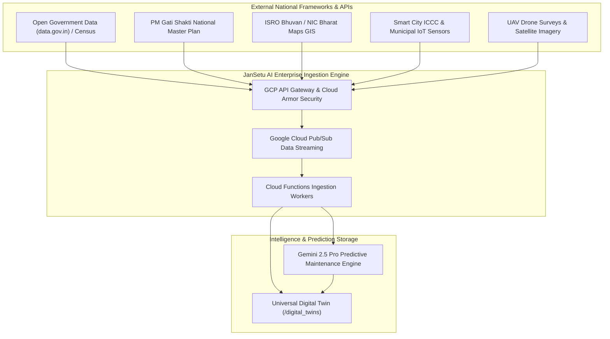
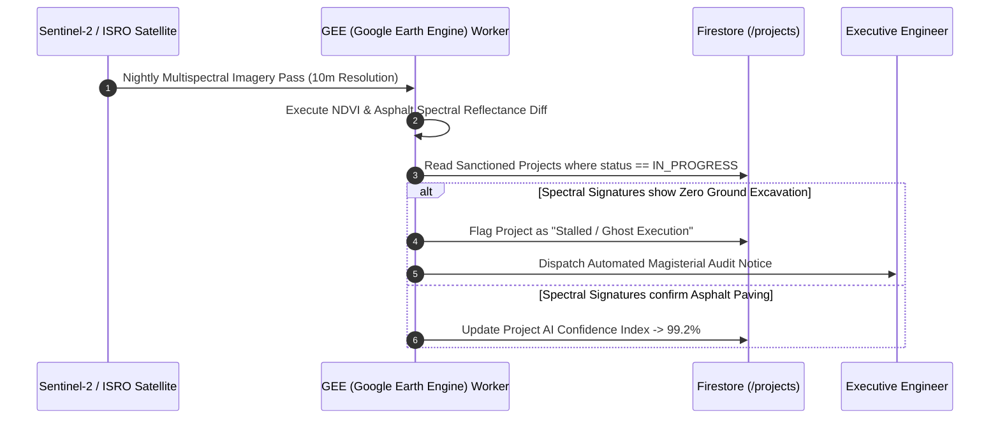

# JanSetu AI — Future Integrations Roadmap & National Scale Architecture
> **AI-Powered Government Digital Ecosystem & Constituency Development Intelligence Platform**
>
> **Version:** 2.0 (Enterprise Ecosystem Edition)
>
> **Document Type:** Future Technical Roadmap & API Ingestion Blueprint
>
> **Purpose:** This document specifies the architectural blueprints, data pipelines, and API integration models required to connect JanSetu AI with national digital infrastructure frameworks, GIS grids, IoT sensor arrays, and predictive AI maintenance engines. Note: In accordance with project instructions, these features are designed structurally for Phase 3–4 rollout and are NOT implemented in current application code.

---

## 1. Executive Roadmap Architecture

To evolve from a reactive civic intelligence platform into an autonomous **Predictive Governance Ecosystem**, JanSetu AI will ingest external telemetry and federal GIS layers through an enterprise API Gateway.

---

## 2. National Framework Integrations

### 2.1 PM Gati Shakti National Master Plan Integration
PM Gati Shakti is India's digital platform bringing together 16 ministries for integrated planning and coordinated implementation of infrastructure connectivity projects.
- **Architectural Binding**: JanSetu AI maps its 11-tier spatial hierarchy directly to PM Gati Shakti GIS polygon layers.
- **Ingestion Workflow**: When an MP sanctions a new rural road (`DEPT_ROADS_HIGHWAYS`), the cloud backend queries the Gati Shakti API via OAuth2 mutual TLS. If the proposed road alignment intersects with a planned NHAI expressway corridor or BharatNet optical fiber trenching schedule, the system flags a **Cross-Ministry Collision Warning** on the MP Decision Dashboard, preventing redundant road digging.

### 2.2 Bharat Maps & ISRO Bhuvan GIS Layering
- **Architectural Binding**: Replaces standard commercial base maps with official Survey of India / NIC Bharat Maps and ISRO Bhuvan satellite overlays.
- **Ingestion Workflow**: Integrates WMS (Web Map Service) and WFS (Web Feature Service) endpoints. Every ward's Digital Twin dynamically imports official government cadastral boundaries, forest reserve geofences, and water body contours.

### 2.3 Open Government Data (data.gov.in) & Census APIs
- **Architectural Binding**: Continuous automated ingestion of socio-economic and demographic datasets.
- **Ingestion Workflow**: Cloud Scheduler triggers nightly batch jobs fetching district-wise Census literacy rates, Aadhaar saturation indices, and NFHS health metrics, populating the `demographics` object of `/digital_twins/{locationId}`.

---

## 3. IoT Telemetry & Real-Time Smart City Ingestion

JanSetu AI will connect with municipal Integrated Command and Control Centers (ICCC) to ingest real-time sensor streams via Google Cloud Pub/Sub.

| IoT Sensor Domain | Ingestion Frequency | Telemetry Payload & Digital Twin Action |
| :--- | :--- | :--- |
| **1. Hydraulic Pressure Sensors** | Real-Time (1-min intervals) | Ingests water pipeline PSI readings. A sudden drop $< 15$ PSI in Ward 14 triggers an automated `/needs` document for `DEPT_WATER_SUPPLY` before citizens report dry taps. |
| **2. Smart Electricity Meters (SCADA)**| Event-Driven | Ingests feeder distribution transformer loads. If transformer load exceeds $95\%$ capacity for 2 hours, AI logs a critical priority warning for transformer upgrade. |
| **3. Flood & Drainage Level Sensors** | Real-Time during monsoon | Ingests storm-water drain water-level telemetry. Levels exceeding $80\%$ height trigger automatic SMS evacuation alerts and BDO drainage desilting orders. |
| **4. Air Quality Index (AQI) Monitors**| Hourly averages | Updates the `environmentalGreenScore` in real time and flags industrial pollution violations to the State Pollution Control Board. |

---

## 4. Satellite Imagery & Drone UAV Change Detection

To monitor capital project execution without relying solely on contractor-submitted photos, the platform will integrate orbital satellite change detection and drone orthomosaics.

---

## 5. Autonomous AI Predictive Maintenance Engine

The ultimate architectural evolution of JanSetu AI is transitioning from *citizen-reported grievances* to *AI-forecasted preventive maintenance*.

### 5.1 Algorithmic Forecasting Workflow
1. **Longitudinal Analysis**: Google Gemini 2.5 Pro continuously scans historical grievance velocity, asset age from `/assets`, and weather forecast APIs (IMD).
2. **Failure Prediction**: If a 15-year-old overhead water tank in Surat experiences 4 minor leakage reports in 6 months while IMD forecasts extreme monsoon temperatures, Gemini calculates an **88.5% 60-Day Structural Failure Probability**.
3. **Autonomous Tender Proposing**: The AI automatically drafts a preventive maintenance work order (`projectId`), estimates required carbon-fiber retrofitting costs, and places an approval card on the Municipal Commissioner's dashboard—**fixing infrastructure before it breaks.**
