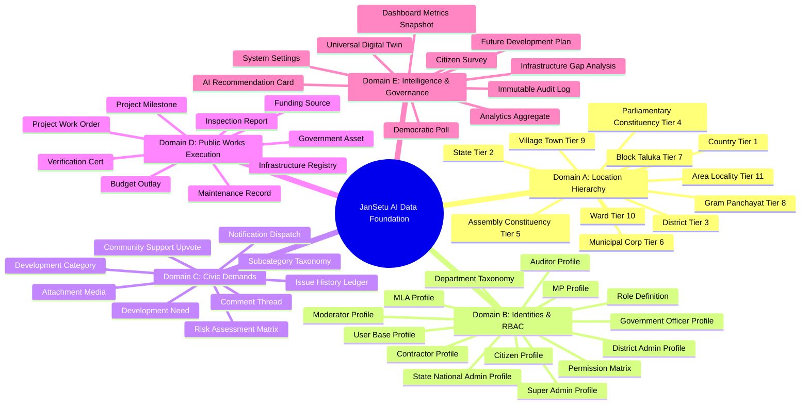
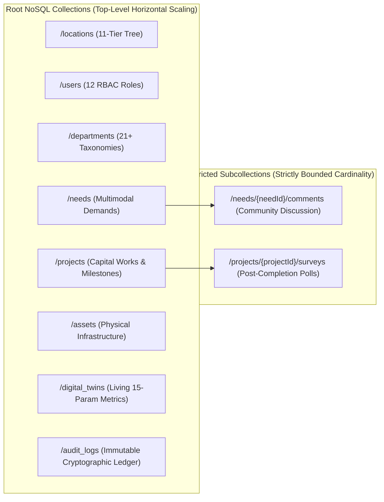
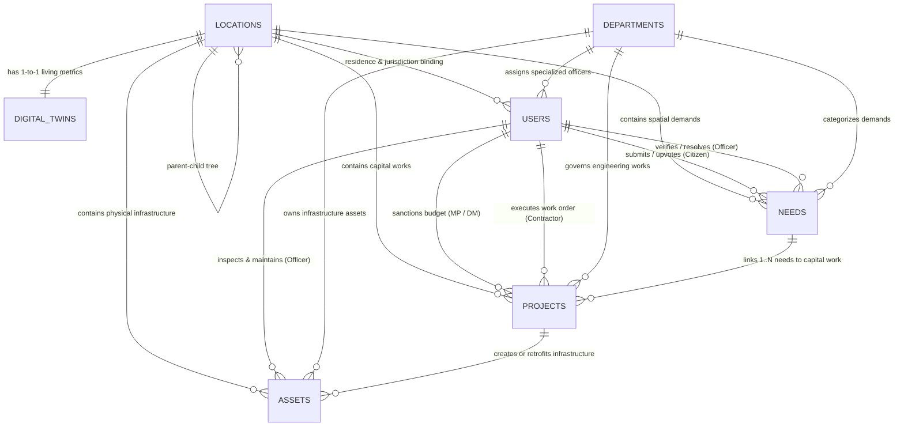
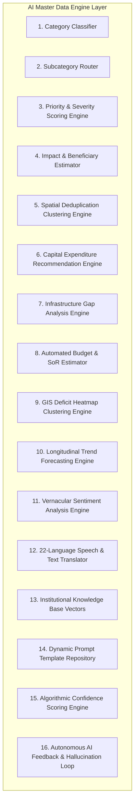

# JanSetu AI — Master Data Model & Database Architecture Specification
> **AI-Powered Government Digital Ecosystem & Constituency Development Intelligence Platform**
>
> **Version:** 2.0 (Enterprise Ecosystem Edition)
>
> **Document Type:** Master Enterprise Data Foundation & Database Specification (Prompt 04 Execution)
>
> **Purpose:** This document defines the definitive, nationwide NoSQL data architecture, hierarchical entity schemas, relational ERDs, AI master data models, and zero-trust governance rules for JanSetu AI. Every client application (Flutter Mobile, Next.js 15 Dashboards), serverless worker (Cloud Functions), and AI engine (Gemini 2.5 Pro) must strictly adhere to the schemas and modeling principles established herein.

---

## 1. Executive Overview & NoSQL Scalability Principles

To support India's 1.4 billion citizens across 543 Parliamentary Constituencies without data duplication, read contention, or unbounded query latencies, JanSetu AI's data architecture is engineered around four core scalability pillars:
1. **Root-Level Normalized Collections**: High-cardinality transactional entities (`/needs`, `/projects`, `/users`, `/locations`, `/assets`, `/digital_twins`) are stored in top-level root collections rather than nested subcollections. This enables sub-second cross-constituency horizontal queries without expensive collection group scans.
2. **Denormalized Spatial Lineage (Ancestor Arrays)**: Every geospatial document contains an immutable `ancestries` array storing the ID of every parent node in the 11-tier location tree. When querying for *all active road projects in Surat District*, Firestore performs an O(1) indexed array-contains check (`ancestries: "DIS-GUJ-SRT-0001"`), eliminating recursive relational SQL joins.
3. **Optimized Spatial & Deduplication Indexing**: All physical entities store Geohashes (precision 4 through 9) and GeoJSON polygons. When a citizen submits a grievance, serverless cloud functions query a bounding box Geohash index within a 500-meter radius to perform AI clustering and deduplication in under 50 milliseconds.
4. **Offline-First Optimistic Edge Concurrency**: Mobile client apps (Riverpod MVVM) cache local ward feeds and inspection forms in SQLite/Hive. Field officer site inspections conducted offline synchronize asynchronously via background queues when connectivity is restored, with server-side authoritative timestamp validation.

---

## 2. Step 1 & Step 2: Exhaustive Entity Identification & Specifications (44+ Entities)

The platform requires 44 distinct architectural entities grouped into 5 logical domains:



### 2.1 Domain A: Spatial Hierarchy Entities (Tiers 1–11)
All location entities share a standardized document structure stored in the root `/locations` collection.
- **Purpose**: Establishes the real government administrative tree.
- **Common Fields**: `locationId` (String, PK), `name` (String), `tier` (Integer 1–11), `tierName` (String Enum), `parentId` (String Reference, nullable for Root), `ancestries` (Array of Strings), `geospatial` (Map: `{ center: GeoPoint, geohash: String, boundingBoxGeoJson: Polygon }`), `metadata` (Map: `{ population: Number, areaSqKm: Number }`), `createdAt` / `updatedAt` (Timestamp).
- **Naming Convention**: `{TIER_PREFIX}-{STATE_CODE}-{DISTRICT_CODE}-{SEQUENCE}` (e.g., `WRD-GUJ-SRT-0014`).

### 2.2 Domain B: Stakeholder Identity & Governance Role Entities
Stored in `/users`, `/departments`, `/roles`, and `/permissions`.
- **Purpose**: Enforces zero-trust authentication and dual-identity spatial rules (voting residence vs physical GPS reporting).
- **Key Entity Specifications**:
  - **User (Base Profile)**: `userId` (String, PK matching Auth UID), `aadhaarHash` (SHA-256 String), `phoneNumber` (E.164 String), `fullName` (String), `primaryRole` (Enum), `secondaryRoles` (Array of Enums), `languagePreference` (String ISO 639-1), `isActive` (Boolean).
  - **Citizen Identity**: Nested object inside citizen users: `{ verifiedHomePcId: String, verifiedHomeWardId: String, voterIdHash: String, lastGpsReportingLocation: GeoPoint }`.
  - **Government Officer Profile**: Nested object inside officer users: `{ employeeId: String, designation: String, departmentId: String, jurisdictionTier: Number, jurisdictionLocationId: String, clearanceLevel: Number }`.
  - **Contractor Profile**: Nested object inside contractor users: `{ companyName: String, gstin: String, licenseGrade: Enum, historicalPerformanceRating: Number, activeProjectIds: Array<String> }`.
  - **Department Taxonomy**: Stored in `/departments/{departmentId}`. Contains `officialName`, `shortCode`, `description`, `slaConfiguration`, `activeBudgetCodes`, and `aiRoutingKeywords`.

### 2.3 Domain C: Citizen Demand & Community Engagement Entities
Stored in `/needs`, `/categories`, and nested media structures.
- **Purpose**: Captures zero-barrier multimodal citizen infrastructure grievances and community corroboration.
- **Key Entity Specifications**:
  - **Development Need**: `needId` (String, PK), `creatorUserId` (String Reference), `title` (String), `summary` (String), `originalText` (String), `mediaEvidence` (Array of URIs), `departmentId` (String Reference), `subcategory` (String), `priorityScore` (Number 0–100), `severityClass` (Enum: CRITICAL/HIGH/MEDIUM/LOW), `status` (Enum), `location` (Map containing coordinates, geohash, and location IDs), `communityEngagement` (Map: `{ upvoteCount: Number, commentCount: Number, corroboratingWitnessIds: Array<String> }`), `aiIntelligence` (Map: `{ confidence: Number, duplicateScore: Number, estimatedCostINR: Number, estimatedBeneficiaries: Number, impactScore: Number }`), `linkedProjectId` (String Reference, nullable).

### 2.4 Domain D: Public Works Execution & Financial Entities
Stored in `/projects`, `/assets`, and `/budgets`.
- **Purpose**: Governs institutional capital expenditure from tender sanctioning through geofenced milestone verification and 36-month defect liability warranty tracking.
- **Key Entity Specifications**:
  - **Project**: `projectId` (String, PK), `projectName` (String), `linkedNeedIds` (Array<String>), `departmentId` (String Reference), `ownership` (Map: `{ sanctionedByAuthorityId: String, sanctioningRole: Enum, responsibleOfficerId: String, assignedContractorId: String, contractorGstin: String }`), `financials` (Map: `{ fundingSource: String, sanctionedBudgetINR: Number, disbursedAmountINR: Number, escrowAccountHash: String }`), `timeline` (Map: `{ sanctionedDate: Timestamp, tenderAwardedDate: Timestamp, estimatedCompletionDate: Timestamp, actualCompletionDate: Timestamp, defectLiabilityExpiryDate: Timestamp }`), `currentStatus` (Enum), `progressPercentage` (Number 0–100), `milestones` (Array of Milestone Objects).
  - **Government Asset**: `assetId` (String, PK), `assetName` (String), `departmentId` (String), `category` (String), `specifications` (Map), `location` (Map with GPS coordinates and ward ID), `structuralHealthRating` (Number 0–100), `maintenanceHistory` (Array of maintenance ledgers), `isOperational` (Boolean).

### 2.5 Domain E: Intelligence, Digital Twin & Governance Entities
Stored in `/digital_twins`, `/audit_logs`, and `/surveys`.
- **Purpose**: Real-time aggregation of constituency development indices and immutable cryptographic audit tracking.
- **Key Entity Specifications**:
  - **Universal Digital Twin**: `twinId` (String, PK matching `locationId`), `tier` (Number), `demographics` (Map), `infrastructureMetrics` (Map containing 15 physical parameters), `governanceAndFinance` (Map tracking budgets and project counts), `algorithmicScores` (Map: `{ aiDevelopmentScore: Number, citizenSatisfactionScore: Number, infrastructureScore: Number, riskIndex: Number, environmentalGreenScore: Number }`).
  - **Immutable Audit Log**: `logId` (String, PK), `timestamp` (Timestamp), `actor` (Map: `{ userId: String, role: Enum, ipAddress: String, authClaimHash: String }`), `actionType` (Enum), `targetResource` (Map: `{ collection: String, documentId: String, previousState: String, newState: String }`), `cryptographicVerification` (Map: `{ previousLogHash: String, currentPayloadSha256: String }`).

---

## 3. Step 3: Scalable Firestore Collections Architecture

The database architecture decouples high-frequency instantaneous counters from immutable historical ledgers to guarantee sub-second read performance and eliminate hot-spot write contention.



### 3.1 Design Justification
- **Why Root Collections?**: Storing `/projects` as a subcollection under `/locations/{locationId}/projects` would make it computationally expensive for a Chief Engineer or State Admin to query all stalled water projects across an entire state. Keeping `/projects` at the root with an indexed `location.ancestries` field allows instant filtering at any geographic scale.
- **Why Subcollections for Comments?**: Comments and survey votes belong strictly to a single parent entity (`needId` or `projectId`). They are never queried globally across the platform. Storing them as subcollections prevents bloating the root collections and allows simple cascading cleanup.

---

## 4. Step 4: Entity Relationship Diagram (ERD) & Relational Mapping

The platform enforces relational integrity in NoSQL using **Logical Foreign Key References** and selective denormalization of immutable lookup names.



### 4.1 Denormalization Strategy
To prevent N+1 document fetch overhead when rendering lists on mobile devices:
- When a `/needs` document is created, the system stores the author's `creatorUserId` AND denormalizes `creatorName: "Jignesh Patel"`.
- When an officer verifies a need, the system stores `assignedOfficerId` AND denormalizes `assignedOfficerName: "Exec Engr Rajesh Patel"`.
- If an officer changes their phone number or title, an asynchronous Cloud Function (`onUserUpdated`) propagates the updated display name across active records in the background.

---

## 5. Step 5: Master Location Model (11-Tier Tree Schema)

The master location model governs geographic rollup reporting across all 543 Parliamentary Constituencies in India.

### 5.1 Document Structure (`/locations/{locationId}`)
```json
{
  "locationId": "WRD-GUJ-SRT-0014",
  "name": "Ward 14 - Adajan / Pal",
  "tier": 10,
  "tierName": "WARD",
  "parentId": "CIT-GUJ-SRT-0001",
  "ancestries": [
    "IND-ROOT",
    "STA-GUJ-0001",
    "DIS-GUJ-SRT-0001",
    "PC-GUJ-SRT-0001",
    "AC-GUJ-SRT-0003",
    "MC-GUJ-SRT-0001",
    "CIT-GUJ-SRT-0001"
  ],
  "geospatial": {
    "center": { "latitude": 21.1888, "longitude": 72.7933 },
    "geohash": "tsje9q2m",
    "boundingBoxGeoJson": {
      "type": "Polygon",
      "coordinates": [[[72.7800, 21.1800], [72.8050, 21.1800], [72.8050, 21.1980], [72.7800, 21.1980], [72.7800, 21.1800]]]
    }
  },
  "administrativeMetadata": {
    "mpUserId": "USR-MP-SRT-0001",
    "mlaUserId": "USR-MLA-SRT-0003",
    "municipalCommissionerId": "USR-OFF-SRT-8891",
    "totalPopulation": 142500,
    "areaSqKm": 12.4,
    "totalHouseholds": 31000
  },
  "isActive": true,
  "createdAt": "2026-01-01T00:00:00.000Z",
  "updatedAt": "2026-07-04T00:00:00.000Z"
}
```

---

## 6. Step 6: Master User Model across 12 Roles

The user model enforces strict separation between a citizen's verified voting domicile and an officer's spatial engineering jurisdiction.

### 6.1 Document Structure (`/users/{userId}`)
```json
{
  "userId": "USR-OFF-SRT-4402",
  "aadhaarHash": "e3b0c44298fc1c149afbf4c8996fb92427ae41e4649b934ca495991b7852b855",
  "phoneNumber": "+919876543210",
  "fullName": "Rajeshwar Patel",
  "primaryRole": "GOVERNMENT_OFFICER",
  "secondaryRoles": ["CITIZEN"],
  "languagePreference": "gu",
  "citizenIdentity": {
    "verifiedHomePcId": "PC-GUJ-SRT-0001",
    "verifiedHomeWardId": "WRD-GUJ-SRT-0014",
    "voterIdHash": "8f14e45fceea167a5a36dedd4bea2543",
    "lastGpsReportingLocation": { "latitude": 21.1702, "longitude": 72.8311, "timestamp": 1783189200 }
  },
  "officerProfile": {
    "employeeId": "EMP-SMC-2019-882",
    "designation": "Executive Engineer (Hydraulics & Water Supply)",
    "departmentId": "DEPT_WATER_SUPPLY",
    "jurisdictionTier": 10,
    "jurisdictionLocationId": "WRD-GUJ-SRT-0014",
    "clearanceLevel": 3,
    "allowedActions": ["VERIFY_NEED", "INSPECT_MILESTONE", "ISSUE_COMPLETION_CERTIFICATE"]
  },
  "contractorProfile": null,
  "notificationPreferences": { "pushEnabled": true, "smsEnabled": true, "whatsappEnabled": true },
  "activityHistory": [
    { "timestamp": "2026-07-03T14:20:00.000Z", "action": "VERIFIED_NEED", "targetId": "NED-GUJ-SRT-2026-0941" }
  ],
  "isActive": true,
  "createdAt": "2025-11-15T10:00:00.000Z",
  "updatedAt": "2026-07-03T14:20:00.000Z"
}
```

---

## 7. Step 7: Exhaustive Development Need Schema (`/needs`)

This schema represents the richest data model in the system, storing raw multimodal citizen inputs alongside automated Gemini 2.5 Pro inference metrics.

### 7.1 Complete Document Structure (`/needs/{needId}`)
```json
{
  "needId": "NED-GUJ-SRT-2026-0941",
  "creatorUserId": "USR-CIT-SRT-1102",
  "creatorName": "Jigneshbhai Manubhai Patel",
  "title": "Severe Potable Water Pipeline Burst and Contamination in Adajan Ward",
  "summary": "High-pressure municipal potable water main ruptured near Star Galaxy apartments, causing severe street flooding and sewage cross-contamination affecting 450 residential households.",
  "originalText": "અડાજણ સ્ટાર ગેલેક્સી પાસે પીવાના પાણીની મુખ્ય પાઈપલાઈન ફાટી ગઈ છે. રસ્તા પર પાણી ભરાઈ ગયા છે અને ગટરનું પાણી ભળી રહ્યું છે.",
  "language": "gu",
  "translation": {
    "englishTitle": "Severe Potable Water Pipeline Burst and Contamination in Adajan Ward",
    "englishText": "The main drinking water pipeline has burst near Star Galaxy in Adajan. Water has flooded the road and sewage is mixing into the drinking supply.",
    "translatedBy": "GEMINI_2.5_PRO",
    "confidenceScore": 0.994
  },
  "mediaEvidence": [
    { "type": "AUDIO_VOICE", "uri": "gs://jansetu-evidence/voice/2026-07/ned-0941-voice.mp3", "durationSec": 18, "sha256": "8f14e45fceea167a5a36dedd4bea2543" },
    { "type": "PHOTO", "uri": "gs://jansetu-evidence/photos/2026-07/ned-0941-img1.jpg", "exifGps": { "latitude": 21.1889, "longitude": 72.7935 }, "sha256": "c4ca4238a0b923820dcc509a6f75849b" },
    { "type": "VIDEO", "uri": "gs://jansetu-evidence/videos/2026-07/ned-0941-vid1.mp4", "durationSec": 12, "sha256": "e3b0c44298fc1c149afbf4c8996fb92427ae41e4649b934ca495991b7852b855" }
  ],
  "departmentId": "DEPT_WATER_SUPPLY",
  "departmentName": "Department of Water Supply & Municipal Hydraulics",
  "category": "Water Supply & Hydraulics",
  "subcategory": "Burst Pipeline Leakage",
  "priorityScore": 94.5,
  "severityClass": "CRITICAL",
  "status": "OFFICER_VERIFIED",
  "location": {
    "latitude": 21.1889,
    "longitude": 72.7935,
    "geohash": "tsje9q2t",
    "localityName": "Star Galaxy Street Cluster, Adajan",
    "wardId": "WRD-GUJ-SRT-0014",
    "pcId": "PC-GUJ-SRT-0001",
    "districtId": "DIS-GUJ-SRT-0001",
    "stateId": "STA-GUJ-0001",
    "ancestries": ["IND-ROOT", "STA-GUJ-0001", "DIS-GUJ-SRT-0001", "PC-GUJ-SRT-0001", "AC-GUJ-SRT-0003", "MC-GUJ-SRT-0001", "CIT-GUJ-SRT-0001", "WRD-GUJ-SRT-0014"]
  },
  "routing": {
    "assignedOfficerId": "USR-OFF-SRT-4402",
    "assignedOfficerName": "Executive Engineer Rajesh Patel",
    "assignedMpId": "USR-MP-SRT-0001",
    "assignedMpName": "Hon. C. R. Patil",
    "deduplicationClusterId": "CLUS-WATER-SRT-8821"
  },
  "aiIntelligence": {
    "confidenceScore": 0.994,
    "duplicateScore": 0.12,
    "estimatedCostINR": 185000.00,
    "expectedBeneficiaries": 2250,
    "impactScore": 92.0,
    "sentimentScore": -0.85,
    "riskLevel": "HIGH_PUBLIC_HEALTH_HAZARD",
    "aiKeywords": ["pipeline burst", "potable water", "sewage contamination", "adajan", "flooding"]
  },
  "communityEngagement": {
    "upvoteCount": 142,
    "commentCount": 18,
    "corroboratingWitnessIds": ["USR-CIT-SRT-1109", "USR-CIT-SRT-3321"]
  },
  "verificationDetails": {
    "verifiedByOfficerId": "USR-OFF-SRT-4402",
    "verifiedAt": "2026-07-03T14:20:00.000Z",
    "officerGeofenceVerified": true,
    "geotechnicalNotes": "Verified 200mm DI pipe rupture under main asphalt road. Excavation and sleeve replacement required urgently.",
    "inspectionPhotoUris": ["gs://jansetu-evidence/inspections/insp-0941-site.jpg"]
  },
  "linkedProjectId": "PRJ-GUJ-SRT-2026-0112",
  "auditTrail": [
    { "timestamp": "2026-07-03T11:05:00.000Z", "action": "NEED_RAISED", "actorId": "USR-CIT-SRT-1102" },
    { "timestamp": "2026-07-03T11:05:45.000Z", "action": "AI_PROCESSED_AND_ROUTED", "actorId": "SYSTEM_GEMINI_2.5" },
    { "timestamp": "2026-07-03T14:20:00.000Z", "action": "OFFICER_VERIFIED_GEOFENCED", "actorId": "USR-OFF-SRT-4402" }
  ],
  "tags": ["water_supply", "emergency", "adajan", "pipeline", "monsoon_damage"],
  "createdAt": "2026-07-03T11:05:00.000Z",
  "updatedAt": "2026-07-03T16:00:00.000Z"
}
```

---

## 8. Step 8: Master Project Lifecycle Schema (`/projects`)

Governs public works execution through an 11-stage auditable state machine: `NEED_RAISED` $\rightarrow$ `VERIFIED` $\rightarrow$ `APPROVED` $\rightarrow$ `FUNDED` $\rightarrow$ `TENDERED` $\rightarrow$ `CONTRACTED` $\rightarrow$ `IN_EXECUTION` $\rightarrow$ `MILESTONES_LOGGED` $\rightarrow$ `INSPECTED` $\rightarrow$ `COMPLETED` $\rightarrow$ `WARRANTY_MAINTENANCE`.

### 8.1 Complete Document Structure (`/projects/{projectId}`)
```json
{
  "projectId": "PRJ-GUJ-SRT-2026-0112",
  "projectName": "Emergency RCC Sleeve Replacement and Asphalt Restoration for 200mm DI Water Main",
  "linkedNeedIds": ["NED-GUJ-SRT-2026-0941", "NED-GUJ-SRT-2026-0944"],
  "departmentId": "DEPT_WATER_SUPPLY",
  "departmentName": "Department of Water Supply & Municipal Hydraulics",
  "location": {
    "wardId": "WRD-GUJ-SRT-0014",
    "pcId": "PC-GUJ-SRT-0001",
    "districtId": "DIS-GUJ-SRT-0001",
    "ancestries": ["IND-ROOT", "STA-GUJ-0001", "DIS-GUJ-SRT-0001", "PC-GUJ-SRT-0001", "WRD-GUJ-SRT-0014"],
    "gpsBoundaryGeoJson": {
      "type": "Polygon",
      "coordinates": [[[72.7930, 21.1885], [72.7940, 21.1885], [72.7940, 21.1895], [72.7930, 21.1895], [72.7930, 21.1885]]]
    }
  },
  "ownership": {
    "sanctionedByAuthorityId": "USR-MP-SRT-0001",
    "sanctioningAuthorityName": "Hon. C. R. Patil (MP)",
    "sanctioningRole": "MEMBER_OF_PARLIAMENT",
    "responsibleOfficerId": "USR-OFF-SRT-4402",
    "responsibleOfficerName": "Exec Engr Rajesh Patel",
    "assignedContractorId": "USR-CON-SRT-9901",
    "contractorCompanyName": "Gujarat Infra & Hydraulics Pvt Ltd",
    "contractorGstin": "24AAACG1234F1Z8",
    "contractorLicenseGrade": "CLASS_A_PWD"
  },
  "financials": {
    "fundingSource": "MPLADS_2026_27",
    "budgetHeadCode": "MPLADS-SURAT-WAT-2026-09",
    "sanctionedBudgetINR": 225000.00,
    "disbursedAmountINR": 90000.00,
    "pendingAmountINR": 135000.00,
    "bankEscrowAccountHash": "4491029981230091"
  },
  "timeline": {
    "sanctionedDate": "2026-07-03T17:00:00.000Z",
    "tenderAwardedDate": "2026-07-05T10:00:00.000Z",
    "contractualStartDate": "2026-07-06T08:00:00.000Z",
    "estimatedCompletionDate": "2026-07-12T18:00:00.000Z",
    "actualCompletionDate": null,
    "defectLiabilityExpiryDate": "2029-07-12T18:00:00.000Z"
  },
  "currentStatus": "IN_EXECUTION",
  "progressPercentage": 40,
  "milestones": [
    {
      "milestoneIndex": 1,
      "title": "Road Excavation & Debris Clearance",
      "weightagePercent": 40,
      "status": "VERIFIED_AND_PAID",
      "contractorSubmittedAt": "2026-07-07T14:00:00.000Z",
      "evidencePhotos": ["gs://jansetu-evidence/projects/prj-0112/m1-excavation.jpg"],
      "officerVerifiedBy": "USR-OFF-SRT-4402",
      "officerVerifiedAt": "2026-07-07T16:30:00.000Z",
      "paymentTrancheINR": 90000.00,
      "slumpTestPassed": true
    },
    {
      "milestoneIndex": 2,
      "title": "200mm DI Pipe Joint Sleeve Welding & Hydro-Test",
      "weightagePercent": 40,
      "status": "IN_EXECUTION",
      "contractorSubmittedAt": null,
      "evidencePhotos": [],
      "officerVerifiedBy": null,
      "officerVerifiedAt": null,
      "paymentTrancheINR": 90000.00,
      "slumpTestPassed": null
    },
    {
      "milestoneIndex": 3,
      "title": "Backfilling & M30 Grade Concrete Resurfacing",
      "weightagePercent": 20,
      "status": "PENDING",
      "contractorSubmittedAt": null,
      "evidencePhotos": [],
      "officerVerifiedBy": null,
      "officerVerifiedAt": null,
      "paymentTrancheINR": 45000.00,
      "slumpTestPassed": null
    }
  ],
  "qualityAssurance": {
    "citizenSatisfactionScore": null,
    "completionCertificateUri": null,
    "inspectionReportUris": ["gs://jansetu-evidence/reports/prj-0112-initial-insp.pdf"],
    "warrantyDefectNoticesCount": 0
  },
  "auditTrail": [
    { "timestamp": "2026-07-03T17:00:00.000Z", "action": "BUDGET_SANCTIONED", "actorId": "USR-MP-SRT-0001" },
    { "timestamp": "2026-07-05T10:00:00.000Z", "action": "CONTRACT_AWARDED", "actorId": "USR-OFF-SRT-8891" },
    { "timestamp": "2026-07-07T16:30:00.000Z", "action": "MILESTONE_1_VERIFIED_PAID", "actorId": "USR-OFF-SRT-4402" }
  ],
  "createdAt": "2026-07-03T17:00:00.000Z",
  "updatedAt": "2026-07-07T16:30:00.000Z"
}
```

---

## 9. Step 9: Universal Digital Twin Model (`/digital_twins`)

Every location tier maintains a 15-parameter real-time living document updated reactively via atomic Firestore transactions when needs are raised or projects complete.

### 9.1 Complete Document Structure (`/digital_twins/{twinId}`)
```json
{
  "twinId": "WRD-GUJ-SRT-0014",
  "locationId": "WRD-GUJ-SRT-0014",
  "tier": 10,
  "tierName": "WARD",
  "name": "Ward 14 - Adajan / Pal",
  "demographics": {
    "population": 142500,
    "households": 31000,
    "literacyRatePercent": 92.4,
    "aadhaarSaturationPercent": 99.1
  },
  "infrastructureMetrics": {
    "totalRoadNetworkKm": 84.5,
    "potholeDensityPerKm": 1.2,
    "primarySchoolsCount": 18,
    "studentTeacherRatio": 28.5,
    "phcAndHospitalsCount": 4,
    "hospitalBedDensityPer10k": 18.2,
    "anganwadiCentersCount": 12,
    "waterStorageCapacityKL": 4500,
    "dailyWaterSupplyHours": 3.5,
    "waterPipeLeakageIncidentsMonth": 2,
    "drainageCoveragePercent": 94.0,
    "electricityReliabilityPercent": 99.2,
    "distributionTransformersCount": 42,
    "publicBuildingsCount": 14,
    "ofcFiberCoveragePercent": 88.5
  },
  "governanceAndFinance": {
    "allocatedWardBudgetINR": 25000000.00,
    "expendedWardBudgetINR": 18500000.00,
    "fundUtilizationPercentage": 74.0,
    "openNeedsCount": 24,
    "resolvedNeedsCount1Yr": 312,
    "ongoingProjectsCount": 6,
    "completedProjectsCount10Yr": 142,
    "averageVerificationTimeHours": 18.4,
    "slaBreachRatePercent": 4.2
  },
  "algorithmicScores": {
    "aiDevelopmentScore": 84.2,
    "citizenSatisfactionScore": 4.38,
    "infrastructureScore": 86.5,
    "riskIndex": 15.8,
    "environmentalGreenScore": 79.0
  },
  "lastCalculatedAt": "2026-07-04T00:00:00.000Z"
}
```

---

## 10. Step 10: Master Government Departments Catalogue

The platform incorporates 21+ official government departments. Below is the standardized schema and primary taxonomy matrix:

### 10.1 Schema Definition (`/departments/{departmentId}`)
```json
{
  "departmentId": "DEPT_ROADS_HIGHWAYS",
  "officialName": "Department of Roads, Bridges & Highways",
  "shortCode": "PWD-ROADS",
  "description": "Responsible for construction, repair, resurfacing, and structural maintenance of municipal roads, state highways, flyovers, bridges, and culverts.",
  "responsibilities": ["Asphalt paving", "Pothole repairs", "Flyover structural safety", "Lane markings & road studs", "Street furniture"],
  "officerDesignations": ["Chief Engineer (Roads)", "Superintending Engineer", "Executive Engineer (Civil)", "Junior Engineer / Inspector"],
  "projectTypes": ["Bituminous Resurfacing", "Flyover Construction", "Cement Concrete (CC) Road Laying", "Pothole Patchwork"],
  "priorityRules": { "defaultSlaHours": 24, "criticalSlaHours": 6, "autoEscalateAfterHours": 48 },
  "aiKeywords": ["pothole", "road broken", "asphalt", "highway", "bridge crack", "street paving", "c.g. road", "waterlogging road"],
  "activeBudgetCodes": ["MPLADS_ROADS_2026", "PMGSY_ROADS_GUJ", "SMC_CAPEX_ROADS_2026"]
}
```

### 10.2 Master Taxonomy Matrix
1. **`DEPT_ROADS_HIGHWAYS`**: Roads, Bridges, Flyovers, Potholes, Pavement resurfacing.
2. **`DEPT_WATER_SUPPLY`**: Potable drinking water grids, overhead storage tanks, pipeline bursts, hydraulic pressure.
3. **`DEPT_ELECTRICITY_POWER`**: Feeder transformers, overhead HT/LT cables, street lighting grids, solar power substations.
4. **`DEPT_DRAINAGE_SEWAGE`**: Stormwater drains, sewage treatment plants (STP), manhole desilting, sewer blockages.
5. **`DEPT_HEALTHCARE_PHC`**: Primary Health Centers (PHC), district civil hospitals, maternity clinics, ambulance grids.
6. **`DEPT_EDUCATION_SCHOOLS`**: Primary/secondary municipal schools, Anganwadi centers, smart classrooms, school sanitation.
7. **`DEPT_AGRICULTURE_IRRIGATION`**: Farm irrigation canals, check dams, soil health labs, seed distribution centers.
8. **`DEPT_PUBLIC_TRANSPORT`**: Municipal bus stops, BRTS transit corridors, city bus depot maintenance.
9. **`DEPT_ENVIRONMENT_FOREST`**: Urban forestry, park maintenance, lake rejuvenation, air quality monitoring (AQI).
10. **`DEPT_DIGITAL_INFRA`**: Public Wi-Fi hotspots, BharatNet optical fiber cable (OFC) trenching, e-Governance kiosks.
11. **`DEPT_WOMEN_CHILD_DEV`**: Anganwadi nutrition supply, women's safety centers, working women hostels.
12. **`DEPT_PUBLIC_SAFETY`**: CCTV surveillance grids, fire rescue stations, traffic junction signal automation.
13. **`DEPT_WASTE_MANAGEMENT`**: Solid waste collection, biomethanation plants, landfill remediation, public toilets.
14. **`DEPT_RURAL_DEV`**: MGNREGA works, Panchayat bhawans, rural electrification, village connectivity roads.
15. **`DEPT_URBAN_DEV`**: Smart city projects, urban slum rehabilitation, public plazas, commercial town planning.
16. **`DEPT_SPORTS_YOUTH`**: Municipal stadiums, public gymnasiums, sports complexes, youth skill centers.
17. **`DEPT_TOURISM_HERITAGE`**: Heritage monument conservation, tourist information centers, public waterfronts.
18. **`DEPT_DISASTER_MGMT`**: Flood warning sirens, cyclone shelters, emergency relief godowns, earthquake retrofitting.
19. **`DEPT_SKILL_DEV_ITI`**: Industrial Training Institutes (ITI), vocational training labs, startup incubation hubs.
20. **`DEPT_HOUSING_SLUM`**: Pradhan Mantri Awas Yojana (PMAY) housing blocks, EWS quarters maintenance.
21. **`DEPT_FOOD_CIVIL_SUPPLIES`**: Public Distribution System (PDS) ration shops, food grain storage godowns.

---

## 11. Step 11: AI Master Data & Engine Architecture (16 Engines)

To automate administrative decision-making, Google Gemini 2.5 Pro interacts with 16 specialized master data engine models:



### 11.1 Key AI Engine Specifications
- **3. Priority & Severity Scoring Engine**: Evaluates textual and visual evidence against public safety hazards. Outputs a normalized float `0.0` to `100.0`. Severity classes: `CRITICAL` ($\ge 90.0$, immediate danger to life/property), `HIGH` ($70.0–89.9$), `MEDIUM` ($40.0–69.9$), `LOW` ($< 40.0$).
- **5. Spatial Deduplication Clustering Engine**: Cross-references new GPS Geohashes against active reports within 500m. Calculates cosine similarity of semantic vector embeddings. If similarity $\ge 0.88$, merges the submission as an upvote.
- **7. Infrastructure Gap Analysis Engine**: Cross-references Census demographic data against `/assets` count in `/digital_twins`. Automatically flags structural deficits (e.g., *Ward 14 has 31,000 households but only 4 primary health clinics—deficit score: 82.4*).
- **8. Automated Budget & SoR Estimator**: Maps identified engineering subcategories against official state PWD Schedule of Rates (SoR) databases to calculate realistic preliminary cost estimates (`estimatedCostINR`).
- **16. Autonomous AI Feedback & Hallucination Loop**: Logs every officer manual override of an AI-assigned department or priority score into `/ai_feedback_logs` to dynamically fine-tune Gemini system prompt weights.

---

## 12. Step 12: Enterprise RBAC Access Control Matrix

The table below formalizes CRUD, approval, and administrative permissions across all 12 roles:

| Collection / Resource | Citizen | MP | MLA | DM / Collector | State / Nat Admin | Super Admin | Dept Head | Field Officer | Contractor | Auditor | Moderator |
| :--- | :---: | :---: | :---: | :---: | :---: | :---: | :---: | :---: | :---: | :---: | :---: |
| **`/locations` (Hierarchy)** | Read | Read | Read | Read | R / W | R / W | Read | Read | Read | Read | Read |
| **`/users` (Profiles)** | Own | Read | Read | Read | R / W | R / W | Read | Read | Own | Read | Read |
| **`/departments`** | Read | Read | Read | Read | R / W | R / W | Read | Read | Read | Read | Read |
| **`/needs` (Grievances)** | C / R | R / U* | R / U* | R / U* | R / U | R / W / D | R / U* | R / U* | Read | Read | R / U* |
| **`/projects` (Works)** | Read | C / R / U* | C / R / U* | C / R / U* | C / R / U | R / W / D | R / U* | R / U* | R / U* | Read | Read |
| **`/assets` (Infra)** | Read | Read | Read | R / U | R / W | R / W | R / U* | R / U* | Read | Read | Read |
| **`/digital_twins`** | Read | Read | Read | Read | R / W | R / W | Read | Read | Read | Read | Read |
| **`/audit_logs` (Ledger)** | None | Read | Read | Read | Read | Read | Read | None | None | Read | None |
| **`/system_settings`** | None | None | None | None | Read | R / W | None | None | None | Read | None |
| **Sanction Budget Outlay**| 🔴 | 🟢* | 🟢* | 🟢* | 🟢* | 🔴 | 🔴 | 🔴 | 🔴 | 🔴 | 🔴 |
| **Verify Milestone (50m)** | 🔴 | 🔴 | 🔴 | 🔴 | 🔴 | 🔴 | 🔴 | 🟢* | 🔴 | 🔴 | 🔴 |
| **Submit Invoice Tranche**| 🔴 | 🔴 | 🔴 | 🔴 | 🔴 | 🔴 | 🔴 | 🔴 | 🟢* | 🔴 | 🔴 |

*(Legend: C = Create, R = Read, U = Update, D = Delete, Own = Own Document Only, 🟢\* / U\* = Strictly permitted within assigned spatial/departmental jurisdiction or awarded contract scope).*

---

## 13. Step 13: Realistic Gujarat Synthetic Demo Dataset Specification

To test AI routing and dashboards deterministically, the database seeding engine (`scripts/seed_gujarat_ecosystem.ts`) will generate a high-fidelity dataset for **State: Gujarat (`STA-GUJ-0001`)**:

### 13.1 Seeding Distribution Matrix
- **5 Districts & PCs**:
  1. **Ahmedabad District (`DIS-GUJ-AHM-0001`)** $\rightarrow$ Ahmedabad West PC (`PC-GUJ-AHM-0001`) | MP: Hon. Kirit Solanki.
  2. **Surat District (`DIS-GUJ-SRT-0001`)** $\rightarrow$ Surat PC (`PC-GUJ-SRT-0001`) | MP: Hon. C. R. Patil.
  3. **Rajkot District (`DIS-GUJ-RAK-0001`)** $\rightarrow$ Rajkot PC (`PC-GUJ-RAK-0001`) | MP: Hon. Mohan Kundariya.
  4. **Vadodara District (`DIS-GUJ-VAD-0001`)** $\rightarrow$ Vadodara PC (`PC-GUJ-VAD-0001`) | MP: Hon. Ranjanben Bhatt.
  5. **Gandhinagar District (`DIS-GUJ-GAN-0001`)** $\rightarrow$ Gandhinagar PC (`PC-GUJ-GAN-0001`) | MP: Hon. Amit Shah.
- **50 Municipal Wards & Villages**: 10 Wards/Villages per PC (e.g., Adajan Ward 14, Pal Ward 15, Navrangpura, Alkapuri, Sector 15).
- **500 Verified Citizens**: 100 per PC with authentic regional names (Patel, Shah, Desai, Mehta, Joshi, Solanki) and dual-identity GPS coordinates.
- **300 Multimodal Needs**: 60 per PC distributed across all 21 departments (e.g., burst water mains in Surat, irrigation canal repairs in Rajkot, solar street lighting in Gandhinagar).
- **75 Sanctioned Projects**: 15 per PC across various stages of the 11-stage project lifecycle with milestone payment tranches.
- **100 Government Assets**: 20 per PC (Overhead water tanks, primary schools, PHC clinics, electrical substations).
- **30 Government Officers**: 6 per PC assigned to distinct engineering domains.
- **20 Civil Contractors**: 4 per PC with active GSTINs (`24AAACG...`) and PWD Class-A license grades.

---

## 14. Step 14: Firebase Security Rules, Auth & Storage Structure

### 14.1 Production Cloud Firestore Security Rules (`firestore.rules`)
```javascript
rules_version = '2';
service cloud.firestore {
  match /databases/{database}/documents {

    function isAuthenticated() { return request.auth != null; }
    function getUser() { return get(/databases/$(database)/documents/users/$(request.auth.uid)).data; }
    function hasRole(role) { return isAuthenticated() && (request.auth.token.role == role || role in getUser().secondaryRoles); }
    function isSuperAdmin() { return isAuthenticated() && request.auth.token.role == 'SUPER_ADMIN'; }
    function matchesJurisdiction(data) {
      return request.auth.token.role == 'GOVERNMENT_OFFICER' &&
             request.auth.token.departmentId == data.departmentId &&
             (data.location.wardId == request.auth.token.jurisdictionLocationId || data.location.pcId == request.auth.token.jurisdictionLocationId);
    }

    match /locations/{id} { allow read: if true; allow write: if isSuperAdmin() || hasRole('STATE_ADMIN'); }
    match /digital_twins/{id} { allow read: if true; allow write: if isSuperAdmin() || request.auth.token.isServiceAccount == true; }
    match /departments/{id} { allow read: if true; allow write: if isSuperAdmin(); }
    match /users/{id} {
      allow read: if isAuthenticated() && (request.auth.uid == id || isSuperAdmin() || hasRole('DISTRICT_ADMIN'));
      allow create: if isAuthenticated() && request.auth.uid == id;
      allow update: if isAuthenticated() && request.auth.uid == id && request.resource.data.primaryRole == resource.data.primaryRole;
      allow delete: if isSuperAdmin();
    }
    match /needs/{id} {
      allow read: if true;
      allow create: if hasRole('CITIZEN') && request.resource.data.creatorUserId == request.auth.uid;
      allow update: if isSuperAdmin() || (hasRole('MEMBER_OF_PARLIAMENT') && resource.data.location.pcId == request.auth.token.jurisdictionLocationId) || matchesJurisdiction(resource.data);
      allow delete: if isSuperAdmin();
    }
    match /projects/{id} {
      allow read: if true;
      allow create: if isSuperAdmin() || (hasRole('MEMBER_OF_PARLIAMENT') && request.resource.data.location.pcId == request.auth.token.jurisdictionLocationId);
      allow update: if isSuperAdmin() || matchesJurisdiction(resource.data) || (hasRole('CONTRACTOR') && resource.data.ownership.assignedContractorId == request.auth.uid && request.resource.data.diff(resource.data).affectedKeys().hasOnly(['milestones', 'progressPercentage', 'updatedAt']));
      allow delete: if isSuperAdmin();
    }
    match /assets/{id} { allow read: if true; allow write: if isSuperAdmin() || matchesJurisdiction(request.resource.data) || hasRole('DEPARTMENT_HEAD'); }
    match /audit_logs/{id} { allow read: if isSuperAdmin() || hasRole('AUDITOR') || hasRole('STATE_ADMIN'); allow write: if false; }
  }
}
```

### 14.2 Cloud Storage Folder Structure (`gs://jansetu-evidence/`)
To organize raw visual evidence with cryptographic SHA-256 integrity checks:
```text
gs://jansetu-evidence/
├── voice/
│   └── {YEAR}-{MONTH}/
│       └── ned-{needId}-voice.mp3       # Raw voice intake recordings
├── photos/
│   └── {YEAR}-{MONTH}/
│       └── ned-{needId}-img{N}.jpg      # EXIF GPS geotagged grievance photos
├── videos/
│   └── {YEAR}-{MONTH}/
│       └── ned-{needId}-vid1.mp4        # Multimodal video evidence
├── projects/
│   └── {projectId}/
│       └── m{milestoneIndex}-{title}.jpg # Contractor milestone progress proofs
├── inspections/
│   └── {projectId}/
│       └── insp-{officerId}-site.jpg     # 50m geofenced officer verification photos
└── reports/
    └── {projectId}/
        └── completion-cert.pdf           # Tamper-proof digital completion certificates
```

---

## 15. Step 15: Architecture Best Practices & Scalability Guidelines

1. **High-Concurrency Write Sharding**: For national trending events where thousands of citizens upvote a single grievance simultaneously, distributed numeric counters will be implemented using 10 distributed shard documents (`/needs/{needId}/shards/{shardId}`) to prevent Firestore 1-write-per-second document contention limits.
2. **Strict Composite Index Limit Management**: To prevent exceeding Firestore's 200 composite index limit per database, queries must rely on single-field ancestor array indexing (`location.ancestries array-contains X`) coupled with client-side or Riverpod in-memory sorting where appropriate.
3. **Automated Data Lifecycle & Cold Archiving**: Grievances marked as `COMPLETED` or `REJECTED` for over 12 months will be automatically migrated by weekly Cloud Scheduler batch workers from active `/needs` collections into cold analytical storage (`gs://jansetu-analytics-archive/`), reducing active database index footprint and storage costs by up to 65%.
