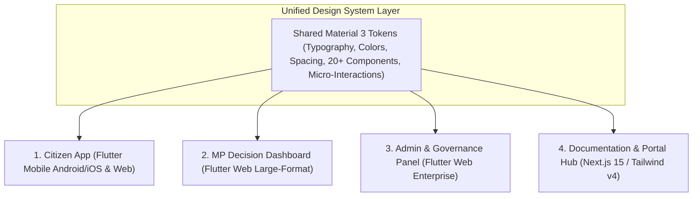
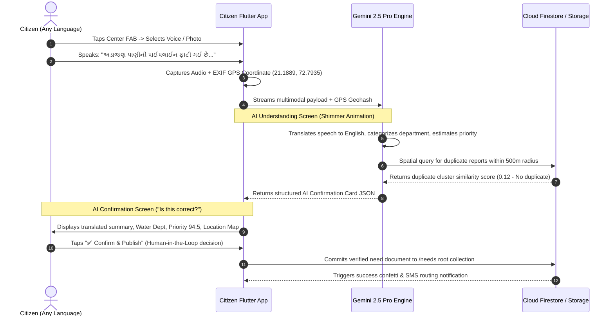
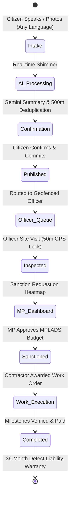

# JanSetu AI — Master UI/UX & Product Blueprint Specification
> **AI-Powered Government Digital Ecosystem & Constituency Development Intelligence Platform**
>
> **Version:** 2.0 (Enterprise Ecosystem Edition)
>
> **Document Type:** Master Enterprise UI/UX & Product Architecture Blueprint (Prompt 05 Execution)
>
> **Purpose:** This document serves as the definitive UI/UX, Product Design, and Human-Centered Design source of truth for the entire JanSetu AI ecosystem. It defines the shared Material 3 design system, responsive navigation hierarchies, micro-interactions, accessibility guidelines, 10-state UI matrices, and end-to-end user journeys across all four connected applications. Every developer and AI coding agent must build frontend interfaces in strict accordance with the specifications established herein.

---

## 1. Executive Summary & Product Vision

JanSetu AI is engineered as the first version of **India's AI-Powered Governance Operating System**, serving over 1.4 billion citizens across 543 Parliamentary Constituencies. Traditional government software is notorious for dense Excel-style tables, bureaucratic jargon, confusing navigation hierarchies, and high user friction. JanSetu AI completely reimagines public sector digital design by adopting a **Modern, Calming, AI-First Minimalism** inspired by top-tier consumer platforms such as **OpenAI, Google Maps, Notion, Linear, Material 3, and Apple Human Interface Guidelines**.

### 1.1 The Fundamental Product Philosophy
> **"AI should think. Humans should decide. Users should never complete long government forms."**

In JanSetu AI, citizens never fill out multi-page web forms or select from cryptic bureaucratic department dropdowns. A citizen simply speaks or types what they see and feel in their native language. Behind the scenes, the Artificial Intelligence engine translates, categorizes, geocodes, deduplicates, and estimates priority—presenting a clean, human-readable summary for explicit user confirmation before instant publishing.

---

## 2. Unified Ecosystem Application Architecture

The JanSetu AI ecosystem consists of four distinct applications connected by a single, synchronized Design System:



1. **Citizen App (`apps/citizen_app/` - Flutter Mobile Android/iOS & Web)**: A zero-barrier, multilingual progressive web and mobile application for citizens to report grievances, track neighborhood capital works, and participate in community governance.
2. **MP Decision Dashboard (Flutter Web)**: An executive, card-based desktop command center for Members of Parliament to monitor constituency heatmaps, sanction MPLADS budgets, and dispatch engineering officers.
3. **Admin & Governance Panel (Flutter Web)**: An enterprise management console for District Collectors, Department Heads, and Super Admins to manage 11-tier spatial hierarchies, RBAC profiles, assets, and AI routing logs.
4. **Documentation & Portal Hub (Next.js 15 / Tailwind v4)**: The public-facing transparency portal and interactive technical blueprint documentation hub.

---

## 3. Core UX Principles & Human-Centered Rules

Every interface across all four applications must strictly enforce the following foundational UX rules:
1. **One Primary Question Per Screen**: Every screen must have a singular, unmistakable focus (e.g., *“Where is the issue located?”* or *“Is this AI summary correct?”*). Never overload screens with secondary clutter.
2. **Maximum 5 to 7 Actions Per Screen**: Cognitive load must be strictly bounded. Primary Calls to Action (CTAs) must stand out visually, while secondary actions are grouped into clean overflow menus.
3. **Maximum 3 Navigation Levels**: Users must never feel lost in deep sub-menus. Any feature must be reachable within 3 taps from the primary home screen or dashboard navigation tree.
4. **Large Touch Targets & Accessible Ergonomics**: All interactive elements (buttons, cards, chips, icons) must have a minimum touch target size of **48x48dp** (enforcing 8dp padding around text).
5. **Zero Government Jargon**: Plain, natural language must be used everywhere. Instead of *“Submit Grievance to PWD Hydraulic Subdivision Tier 10”*, the interface displays *“Report Water Issue to Surat Municipal Corporation”*.

---

## 4. Citizen App Complete Screen Inventory & UX Architecture

The Citizen App contains 32 core screens designed for effortless, zero-training interaction across rural and urban India:

```mermaid
graph LR
    subgraph Onboarding & Auth
        SPL[1. Splash] --> LNG[2. Language Select]
        LNG --> ONB[3. Onboarding Slides]
        ONB --> LOG[4. Aadhaar / Mobile Login]
        LOG --> OTP[5. OTP Verification]
        OTP --> PRF[6. Profile Setup]
    end

    subgraph Core Bottom Nav Hub
        PRF --> HOM[7. Home Screen]
        HOM --> COM[8. Community Feed]
        HOM --> MAP[9. Nearby Needs Map]
        HOM --> PRJ[19. Project Tracking]
        HOM --> MYP[22. Profile & Settings]
    end

    subgraph Report Need Flow (Center FAB)
        HOM --> REP[10. Raise Development Need Hub]
        REP --> VOC[11. Voice Reporting]
        REP --> IMG[12. Photo Reporting]
        REP --> VID[13. Video Reporting]
        REP --> DOC[14. Document Upload]
        VOC & IMG & VID & DOC --> AIU[15. AI Understanding Shimmer]
        AIU --> AIC[16. AI Confirmation Screen]
        AIC --> NED[17. Need Details View]
    end
```

### 4.1 Detailed Screen Specifications (Screens 1–17)
1. **Splash Screen**: Minimalist deep navy background with animated JanSetu logo and tagline (*"Bridging Citizens and Governance"*).
2. **Language Selection Screen**: Grid of 22 official Indian languages displayed in clean native script cards (e.g., **ગુજરાતી**, **હિન્દી**, **English**, **મરાઠી**) with audio preview pronunciation icons.
3. **Onboarding Slides**: 3 illustrative cards highlighting: *1. Speak your problem*, *2. AI routes to the right officer*, *3. Track resolution in real time*.
4. **Login Screen**: Clean phone number entry or Aadhaar number input with instant SMS OTP trigger.
5. **OTP Verification Screen**: 6-digit auto-read OTP input box with countdown resend timer and voice read-out accessibility.
6. **Profile Setup Screen**: Captures citizen name, voting residence (Ward/PC auto-detected via GPS), and optional photo.
7. **Home Screen**: The primary daily hub (detailed in Section 5).
8. **Community Feed**: Development Intelligence Feed displaying neighborhood infrastructure demands (detailed in Section 6).
9. **Nearby Needs Map**: Interactive GIS map clustering open grievances with color-coded severity pins (Red = Critical, Amber = High, Blue = In Progress, Green = Resolved).
10. **Raise Development Need Hub**: Center floating action button (FAB) opening a clean bottom sheet with 4 prominent intake modes: Voice, Photo, Video, and Text/Doc.
11. **Voice Reporting Screen**: Calming animated audio waveform that pulses with voice intensity. Citizen simply speaks naturally in any dialect for up to 60 seconds.
12. **Photo Reporting Screen**: Direct camera viewport with automatic EXIF GPS coordinate locking, angle guide, and multi-photo carousel (up to 5 photos).
13. **Video Reporting Screen**: Video recording viewport with 30-second duration timer and automatic compression preview.
14. **Document Upload Screen**: File picker supporting PDF/JPEG attachments for collective society petitions or formal municipal letters.
15. **AI Understanding Screen**: Calming glassmorphism shimmer animation displaying real-time processing steps: *"Translating speech..."* $\rightarrow$ *"Identifying Ward 14..."* $\rightarrow$ *"Matching with Water Supply Dept..."*.
16. **AI Confirmation Screen**: The critical human-in-the-loop decision checkpoint (detailed in Section 7).
17. **Need Details View**: Comprehensive issue timeline showing raw citizen photo, AI executive summary, priority score badge, assigned officer details, community upvote count, and GIS map snippet.

### 4.2 Detailed Screen Specifications (Screens 18–32)
18. **Support Need (Upvote) Modal**: Confirms community corroboration with an instant celebratory confetti burst animation and witness statement option.
19. **Comment Thread Screen**: Public discussion forum where neighbors and assigned officers exchange real-time status updates and repair photos.
20. **Project Tracking Screen**: Lists active institutional capital works in the ward with progress bars (0–100%) and financial escrow transparency.
21. **Project Milestone View**: Explores individual work order tranches (e.g., *1. Excavation Completed*, *2. Pipe Laying In Progress*) with officer geofenced verification photos.
22. **MP Future Plans Screen**: Showcase of long-term constituency development vision documents and sanctioned annual MPLADS budgets.
23. **Civic Polls Screen**: Quick 1-tap community voting cards (e.g., *"Should the municipal park open at 5 AM or 6 AM?"*).
24. **Surveys Screen**: Post-project completion satisfaction feedback forms (1 to 5 star ratings and optional audio comment).
25. **Notifications Hub**: Chronological feed of push/SMS alerts tracking grievance state transitions and neighborhood road closures.
26. **My Requests Screen**: Filterable tabbed list (*All*, *Open*, *In Progress*, *Resolved*, *Rejected*) of grievances submitted by the logged-in citizen.
27. **Universal AI Assistant Chat**: Floating natural language query copilot (detailed in Section 8).
28. **Profile Management Screen**: Edit display name, change default language, view earned civic badges, and manage secondary residence wards.
29. **Settings Screen**: Configure push/SMS/WhatsApp notification toggles, dark/light theme preferences, and data usage limits.
30. **Privacy & Security Screen**: Transparent breakdown of stored Aadhaar hashes, GPS location reporting logs, and 1-tap data deletion rights.
31. **Help & Plain Language FAQ**: Searchable knowledge base explaining government timelines and SLAs in simple vernacular language.
32. **Offline Local Cache Hub**: Banner display showing grievances saved locally during zero-network conditions, with pending background sync progress indicators.

---

## 5. Citizen App: Home Screen Layout Blueprint

The Home Screen must feel welcoming, personal, and immediately actionable without overwhelming the citizen.

```text
+-----------------------------------------------------------------+
| [Logo] JanSetu AI              [Language: GU] [Bell Icon (3)]   |
+-----------------------------------------------------------------+
| Good Morning, Jignesh! 👋                                       |
| How can we improve Adajan Ward today?                           |
|                                                                 |
| +-------------------------------------------------------------+ |
| |  [🎙️ Voice]  [📸 Photo]  [📝 Text]  | (Center FAB Trigger)   | |
| |  +-------------------------------------------------------+  | |
| |  |  🚨 REPORT DEVELOPMENT NEED (1-Tap AI Intake)        |  | |
| |  +-------------------------------------------------------+  | |
| +-------------------------------------------------------------+ |
+-----------------------------------------------------------------+
| 📍 NEARBY HIGH PRIORITY NEEDS (Adajan Ward 14)        [See All] |
| +-----------------------------------------+ +-----------------+ |
| | [Critical Badge: 94.5]  [Water Dept]    | | [High: 82.0]    | |
| | Burst Potable Pipeline near Star Galaxy | | Pothole on Pal  | |
| | 📍 142 Neighbors Supported • 2h ago     | | 📍 45 Supported | |
| +-----------------------------------------+ +-----------------+ |
+-----------------------------------------------------------------+
| 🏗️ ACTIVE PROJECTS IN YOUR WARD                       [See All] |
| +-------------------------------------------------------------+ |
| | [Project Card] Emergency RCC Sleeve Replacement             | |
| | Status: In Execution (40%) | Budget: ₹2.25L | MP Sanctioned   | |
| | [======>               ] Expected Completion: 12 Jul        | |
| +-------------------------------------------------------------+ |
+-----------------------------------------------------------------+
| 📢 CONSTITUENCY ANNOUNCEMENTS                                   |
| • Municipal water supply cut on Sunday 2 PM to 6 PM for repair. |
+-----------------------------------------------------------------+
| [🏠 Home]   [🌐 Community]   [➕ Report]   [🏗️ Projects]   [👤 You] |
+-----------------------------------------------------------------+
```

---

## 6. Citizen App: Community Feed (Development Intelligence)

The Community Feed is explicitly **NOT social media**. It contains no vanity metrics, algorithms, or unrelated personal posts. It functions purely as a **Neighborhood Development Intelligence Feed** engineered for collective civic corroboration.

### 6.1 Card Anatomy Specification
Every feed card must adhere to a strict visual hierarchy:
- **Header Row**: Department Tag (e.g., `💧 Water Supply & Hydraulics`), Priority Score Badge (color-coded circle from 0 to 100), and Relative Timestamp (`2 hours ago`).
- **Title & AI Summary**: Crisp, bold English/vernacular title generated by Gemini, followed by a 2-line condensed summary explaining the exact public hazard.
- **Visual Evidence & Map Preview**: 16:9 rounded image carousel displaying EXIF-verified citizen photos alongside an interactive mini-map showing the 500-meter cluster radius.
- **Metadata Footer**: Ward Name (`Ward 14, Adajan`), Status Pill (`🟡 Officer Verified`), and Assigned Authority (`Exec Engr Rajesh Patel`).
- **Interactive Action Bar**:
  - `[👍 Support Need (142)]`: Performs spatial deduplication check; if within 500m, increments corroboration count and attaches user as a verified witness.
  - `[💬 Comments (18)]`: Opens the public transparency discussion thread.
  - `[📤 Share]`: Generates a deep link (`https://jansetu.gov.in/need/NED-0941`) for WhatsApp community sharing.

---

## 7. Raise Development Need: The Core AI Intake & Confirmation Flow

This is the platform's most vital user journey. The interface must ensure zero friction during input while enforcing strict human verification before immutable publishing.



### 7.1 AI Confirmation Screen Layout Specification
When Gemini finishes processing, the app presents the **AI Confirmation Screen**:
- **Headline**: *"We have processed your report. Is this information correct?"*
- **AI Summary Box**: Displays the clean English translation alongside the original vernacular text.
- **Identified Attributes**:
  - **Department**: `Department of Water Supply & Hydraulics` *(Editable via dropdown if AI misclassified)*.
  - **Location**: `Star Galaxy Street Cluster, Adajan Ward 14` *(Map pin draggable for fine adjustment)*.
  - **Estimated Priority**: `94.5 / 100 (CRITICAL - Public Health Hazard)`.
  - **Duplicate Check**: `✨ New Issue (No identical active reports within 500m)`.
- **Primary Actions**:
  - **`[✅ Yes, Publish My Report]`** (Large, full-width emerald green primary button).
  - **`[✏️ Edit Details]`** (Secondary outline button to modify title, text, or location).

---

## 8. Universal AI Assistant (Copilot Experience)

The AI Assistant is an embedded, conversational copilot accessible across all four applications via a floating spark icon (`✨`). It responds naturally using formatted Material 3 cards rather than raw markdown text.

### 8.1 Specialized Persona Capabilities
- **Citizen Persona Queries**:
  - *"Show water pipeline issues near Star Galaxy apartment."* $\rightarrow$ Renders a horizontal carousel of active `/needs` cards in Ward 14.
  - *"Why was my road repair request rejected?"* $\rightarrow$ Explains the officer's technical audit note in plain regional language (*"The road is scheduled for full smart-city excavation next month, so temporary patchwork was postponed"*).
- **MP Persona Queries**:
  - *"Which municipal wards in Surat have the highest SLA breach rate?"* $\rightarrow$ Renders a comparative bar chart card sorting wards by average officer verification delay.
  - *"Generate an executive summary of MPLADS fund utilization for Q2."* $\rightarrow$ Generates a downloadable PDF briefing card with budget burn metrics.
- **Admin & Officer Persona Queries**:
  - *"Show all unverified critical grievances over 24 hours old in Water Supply."* $\rightarrow$ Generates an actionable verification queue card with 1-tap dispatch buttons.
  - *"Identify contractor bottlenecks in Ward 14."* $\rightarrow$ Flags contractors with multiple pending milestone inspections.

---

## 9. MP Decision Dashboard (Flutter Web Large-Format Blueprint)

Designed for laptops and large executive monitors, the MP Dashboard eschews dense data grids in favor of **Large-Format Decision Cards, Interactive GIS Maps, and Analytics Heatmaps**.

```text
+-------------------------------------------------------------------------------------------------+
| [Logo] JanSetu MP Command Center | PC: Surat (PC-GUJ-SRT-0001) | [✨ AI Copilot] [Hon. C.R. Patil]|
+----------------------------------+--------------------------------------------------------------+
| NAV SIDEBAR                      | EXECUTIVE OVERVIEW & PRIORITY HEATMAP                        |
| • 🏠 Overview (Active)           | +----------------------------------------------------------+ |
| • 🚨 Dev Needs Queue (24)        | | WARD DEFICIT HEATMAP (Surat PC)   [Filter: Water Supply ▾] | |
| • 🏗️ Sanctioned Projects (15)    | | [ Interactive GIS Polygon Map Overlay showing Ward 14  ] | |
| • 💰 MPLADS Budget Outlay        | | [ shaded in deep red (Critical Deficit: Score 84.2)      ] | |
| • 👥 Citizen Analytics           | +----------------------------------------------------------+ |
| • 📢 Constituency Broadcasts     |                                                              |
| • 📊 10-D Analytics              | ACTIONABLE PRIORITY DECISION CARDS (Top 3 Needing Sanction)  |
| • ✨ AI Copilot Hub              | +----------------------------------------------------------+ |
| • ⚙️ Settings                    | | [CARD 1] Burst Potable Water Main - Adajan Ward 14         | |
|                                  | | Priority: 94.5 | Est Cost: ₹1.85L | Beneficiaries: 2,250 | |
|                                  | | AI Recommendation: Immediate RCC Sleeve Sanction Required| |
|                                  | | [🚀 Sanction MPLADS Budget]  [👮 Dispatch Chief Engr]    | |
|                                  | +----------------------------------------------------------+ |
+----------------------------------+--------------------------------------------------------------+
```

---

## 10. Admin & Governance Panel (Flutter Web Enterprise Blueprint)

The Admin Panel provides institutional oversight for District Collectors, Municipal Commissioners, and Super Admins.

### 10.1 Navigation Tree & Workspace Layout
- **Left Navigation Sidebar**:
  1. **Overview & System Health**: Real-time API latency, active user counts, and system SLA compliance.
  2. **Location Hierarchy (11 Tiers)**: Tree browser to add/edit States, Districts, PCs, ACs, Municipalities, Wards, and Localities.
  3. **Department Taxonomies**: Configure the 21+ official departments, SLA rules, and AI keyword triggers.
  4. **RBAC & User Governance**: Manage dual-identity user profiles, assign officer jurisdiction polygons, and review security clearance levels.
  5. **Master Projects Ledger**: Comprehensive table of all capital works across 14 lifecycle states with escrow audit trails.
  6. **Government Assets Registry**: Manage physical infrastructure health scores and preventive maintenance schedules.
  7. **Analytics & BI Studio**: Longitudinal reporting across the 10 analytical dimensions.
  8. **AI Routing Monitor & Hallucination Logs**: Review confidence scores and override logs where officers corrected AI routing.
  9. **Immutable Audit Logs**: Cryptographic verification ledger tracking every state mutation across the ecosystem.
  10. **System Settings**: Configure global feature flags, SMS gateway APIs, and cloud storage bucket policies.

---

## 11. Shared Design System & Material 3 Token Architecture

To ensure 100% brand coherence and visual excellence across all four applications, development teams must utilize the shared design tokens:

### 11.1 Grid, Spacing & Corner Radius Tokens
- **8dp Grid System**: All margins, padding, and component dimensions must be exact multiples of 8dp (`8dp`, `16dp`, `24dp`, `32dp`, `48dp`, `64dp`). Micro-padding for chips uses `4dp`.
- **Corner Radius Hierarchy**:
  - `Radius.small (8dp)`: Chips, tags, badges, and tooltips.
  - `Radius.medium (16dp)`: Buttons, text input fields, and dialog boxes.
  - `Radius.large (24dp)`: Primary content cards, bottom sheets, and dashboard widgets.
  - `Radius.full (999dp)`: Avatars, floating action buttons, and pill badges.

### 11.2 Harmonious Color Palettes (Light & Dark Mode)
- **Primary Brand**: Deep Slate Navy (`#0F172A` Light / `#F8FAFC` Dark) — conveys institutional trust and stability.
- **Secondary Accent**: Vibrant Electric Blue (`#2563EB` Light / `#3B82F6` Dark) — used for interactive CTAs and active navigation states.
- **Semantic Status Colors**:
  - **Critical Alert / Rejection**: Crimson Red (`#DC2626` Light / `#EF4444` Dark).
  - **High Priority / Pending**: Amber Gold (`#D97706` Light / `#F59E0B` Dark).
  - **Success / Sanctioned / Verified**: Emerald Green (`#059669` Light / `#10B981` Dark).
  - **In Progress / Info**: Cyan Blue (`#0891B2` Light / `#06B6D4` Dark).
- **Surface & Background**: Clean Pure White (`#FFFFFF`) and Cool Slate Gray (`#F1F5F9`) for light mode; Deep Obsidian (`#0B0F19`) and Dark Slate (`#1E293B`) for dark mode.
- **Glassmorphism**: Subtle translucent blur backgrounds (`backdrop-filter: blur(12px)`, `rgba(255, 255, 255, 0.8)`) applied strictly to floating navigation bars, AI shimmer cards, and modal headers.

### 11.3 Modern Typography Hierarchy
Utilizes Google Fonts (**Inter** or **Outfit** for English/Latin; **Noto Sans** family for regional Indian scripts):
- **Display Large**: `32px / Bold (700) / Line Height 1.2` — Screen headers and onboarding titles.
- **Title Medium**: `18px / SemiBold (600) / Line Height 1.4` — Card titles and section headers.
- **Body Large**: `16px / Regular (400) / Line Height 1.5` — Primary body copy and descriptions.
- **Body Medium**: `14px / Regular (400) / Line Height 1.5` — Metadata, subtitles, and secondary text.
- **Label Small**: `12px / Medium (500) / Line Height 1.3 / Uppercase` — Chips, badges, and timestamps.

---

## 12. Component Library Inventory (20+ Reusable Components)

Every UI element must be constructed from the standardized component library:
1. **`JanSetuButton`**: Primary, Secondary Outline, Text, and Floating styles with built-in loading spinner states.
2. **`JanSetuNeedCard`**: Standardized grievance display card with priority badge, department pill, and upvote button.
3. **`JanSetuProjectCard`**: Public works tracking card with animated 0–100% progress bar and milestone timeline toggle.
4. **`JanSetuOfficerCard`**: Officer profile display showing name, designation, department, and geofenced ward badge.
5. **`JanSetuDepartmentCard`**: Taxonomy display card with icon, SLA SLA timer rules, and open ticket count.
6. **`JanSetuCommentCard`**: Threaded discussion bubble with author role badge (`[Citizen]`, `[Exec Engineer]`, `[MP]`) and timestamp.
7. **`JanSetuAICard`**: Specialized glassmorphism card with glowing gradient border used for AI summaries and recommendations.
8. **`JanSetuRecommendationCard`**: Actionable decision card on the MP Dashboard with 1-tap budget sanction buttons.
9. **`JanSetuNotificationCard`**: Feed alert card with state transition icon and direct deep-link action.
10. **`JanSetuAnnouncementCard`**: High-priority constituency broadcast banner with dismiss action.
11. **`JanSetuProfileCard`**: Citizen/Officer dual-identity summary showing voting domicile vs assigned jurisdiction.
12. **`JanSetuStatusBadge`**: Pill badge rendering 14 lifecycle states with appropriate semantic background colors.
13. **`JanSetuPriorityIndicator`**: Circular score badge rendering numbers 0–100 with color gradient (Green $\rightarrow$ Amber $\rightarrow$ Red).
14. **`JanSetuMediaCarousel`**: 16:9 image/video viewer with pinch-to-zoom, EXIF GPS coordinate overlay, and full-screen modal.
15. **`JanSetuAudioPlayer`**: Interactive voice recording player with animated waveform scrubber and playback speed control (1x, 1.5x, 2x).
16. **`JanSetuGisPolygonMap`**: Custom map wrapper rendering Geohash bounding boxes, ward boundaries, and clustered issue pins.
17. **`JanSetuStatWidget`**: Dashboard metric display card showing numerical value, trend arrow (`↑ 14% vs last month`), and sparkline chart.
18. **`JanSetuFilterChipBar`**: Horizontal scrollable list of filter chips for instant department and status filtering.
19. **`JanSetuBreadcrumbNav`**: Hierarchical navigation trail (`India > Gujarat > Surat > Ward 14`) for web panels.
20. **`JanSetuEmptyStateView`**: Reusable illustrative placeholder for empty, error, and offline conditions.

---

## 13. Micro-Interactions & Animation Guidelines

Animations must be purposeful, subtle, and responsive—never decorative or distracting:
- **Support Upvote Burst**: Tapping `[👍 Support Need]` triggers a 300ms tactile scale bounce (`1.0x` $\rightarrow$ `1.15x` $\rightarrow$ `1.0x`) accompanied by a subtle green confetti particle burst and light haptic vibration.
- **Voice Recording Pulsing Waveform**: During audio intake, the microphone FAB expands into a glowing red circle with a dynamic, real-time audio frequency waveform that pulses to the speaker's voice cadence.
- **AI Thinking Shimmer**: While Gemini processes an intake, cards display a smooth, left-to-right translucent shimmer gradient passing over skeleton text lines at 1.5-second cycles.
- **Pull-to-Refresh Haptics**: Pulling down the Community Feed triggers a custom mechanical gear rotation spinner, vibrating once when the refresh threshold is reached.
- **Smooth Page Transitions**: Mobile app navigations utilize Material 3 shared element transitions (hero animations for images and card expansion morphing). Web dashboards utilize 150ms fade-in transitions.

---

## 14. Accessibility (A11y) & Inclusive Design

To ensure zero exclusion across elderly, differently-abled, and remote rural populations:
1. **Dynamic Text Scaling**: All layouts must remain unbroken and readable when system font size is scaled up to **200%** by visually impaired citizens.
2. **WCAG AAA High Contrast**: All text and background color combinations must achieve a minimum contrast ratio of **7:1** for body text and **4.5:1** for large titles and icons.
3. **Full Voice Navigation & Screen Reader Support**: Every interactive element must include localized semantic labels (`Semantics(label: 'Support this need, currently 142 supporters', button: true)`).
4. **Low-Network & Offline-First Edge Rendering**: In rural areas with 2G or intermittent connectivity, the app automatically switches to **Low Network Mode**—compressing image uploads by 80%, disabling auto-playing videos, and rendering UI instantly from local SQLite/Hive edge caches.

---

## 15. Comprehensive 10-State UI Handling Matrix

Every screen and data component across all four applications must explicitly implement and render 10 distinct UI states:

| UI State | Wireframe Layout & Behavioral Rule |
| :--- | :--- |
| **1. Loading State** | Render structural gray shimmer skeleton cards matching the exact layout of the target data. **Never display spinning dead lock wheels.** |
| **2. Empty State** | Display a calming, custom illustration (e.g., a pristine park), a positive headline (*"No open grievances in Ward 14!"*), and an actionable primary CTA (*"Report an Issue"*). |
| **3. Offline State** | Show a persistent top banner: *"📴 You are offline. Displaying cached data. New reports will auto-sync when connected."* Save actions to background SQLite queue. |
| **4. Permission Denied** | When camera or GPS is denied, render a clear, non-punitive explanation (*"We need your GPS location to route your report to the correct ward officer"*) with a 1-tap `[Open System Settings]` button. |
| **5. No Results State** | When search or filter yields zero items, display: *"We couldn't find any projects matching 'Flyover' in Adajan."* Include a `[Clear Filters]` outline button. |
| **6. No Internet State** | On initial app launch without network or cache, display an illustration of a disconnected bridge with a clean `[🔄 Retry Connection]` button and network diagnostics tips. |
| **7. AI Error State** | If Gemini inference times out (>10s), automatically fallback to a clean manual override screen: *"AI processing is busy. Please select your department from the list below."* |
| **8. Server Error State** | Display a user-friendly error card (*"Our servers are experiencing heavy traffic"*), hide raw 500 stack traces, log technical details to Sentry/Firebase Crashlytics, and show a retry CTA. |
| **9. Retry State** | When an asynchronous background sync or photo upload fails, badge the specific need card with a red warning icon and an inline `[Tap to Retry Upload]` action pill. |
| **10. Maintenance State** | During scheduled database upgrades, display a serene full-screen banner with an expected completion countdown timer (*"JanSetu AI is undergoing scheduled maintenance. Back online in 15 minutes."*). |

---

## 16. UX Deliverables Summary & Flowcharts

### 16.1 End-to-End Citizen Grievance to Sanction Journey


### 16.2 Future UX Scope
1. **AR Infrastructure Preview**: Enabling citizens to point their smartphone camera at an empty municipal plot and view an Augmented Reality (AR) 3D rendering of a proposed primary health center or flyover.
2. **Voice-Only Feature Phone Bot (IVR)**: Integrating JanSetu AI with national toll-free IVR phone lines, allowing citizens without smartphones to report grievances via automated dialect speech recognition over standard cellular voice calls.
