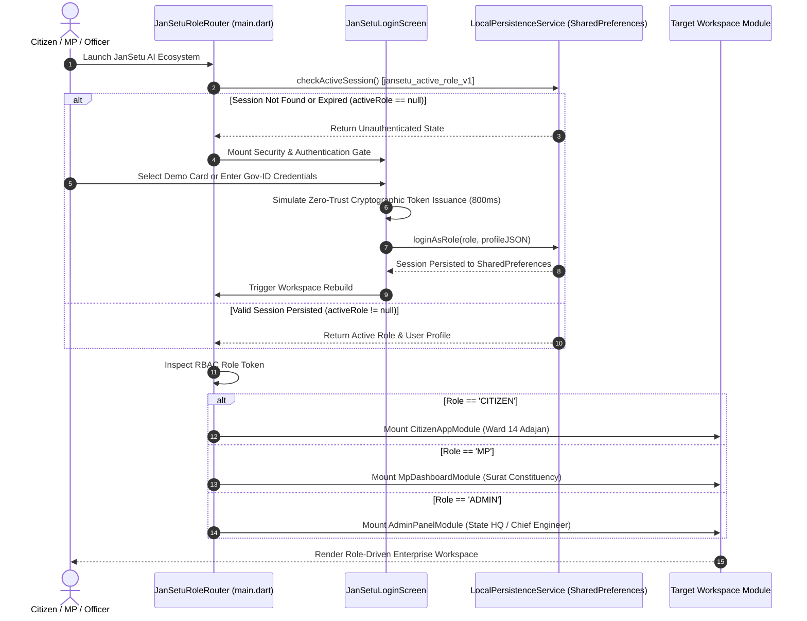

# JanSetu AI — Role-Driven Authentication Portal & Automated Workspace Routing Architecture

**Document Reference**: `docs/09_PRODUCT_REDESIGN_AND_COMPLETE_USER_FLOW.md`  
**Parent Blueprint**: `docs/00_PROJECT_CONTEXT.md`  
**Execution Prompt**: `prompts/06_PRODUCT_REDESIGN_AND_COMPLETE_USER_FLOW.md`  
**Target Release**: JanSetu AI Enterprise Governance v2.0 (Phase 10 Deliverable)  

---

## 1. Executive Summary & Architectural Philosophy

In legacy e-Governance systems, citizens, parliamentary representatives, and administrative bureaucrats interact with fragmented software ecosystems—downloading isolated mobile apps, accessing disconnected web portals, and struggling with redundant authentication barriers.

**JanSetu AI** redefines state digital infrastructure through a **Unified Zero-Trust Digital Twin Portal**. Instead of presenting separate entry points (`Citizen Application`, `MP Command Center`, `State Admin Panel`) on startup, the platform deploys a single enterprise entry point: the **JanSetu AI Security & Authentication Gate**. 

Upon cryptographic authentication, the platform's **Automated Role Routing Engine** dynamically inspects the user's Zero-Trust RBAC token and mounts the exact operational workspace tailored to their governance tier and jurisdictional geofence. For product evaluators and hackathon judges, the architecture embeds a zero-friction **Hackathon Demo Suite**, featuring instant 1-Tap Quick-Login cards and a hidden **Dev-Mode Persona Switcher** for real-time live demonstrations.

---

## 2. Zero-Trust Authentication Architecture & State Machine

The authentication engine simulates production-grade cryptographic identity verification (Aadhaar Vidya, Parichay Gov-ID, and NIC e-Pramaan) integrated with local persistence (`shared_preferences`) to maintain session continuity across application lifecycles.

### 2.1 Role-Driven Launch & Authentication Flow (Mermaid Diagram)



---

## 3. Automated Role Routing & Workspace Mounting Matrix

Once authenticated, `JanSetuRoleRouter` acts as an invariant governance gatekeeper. It prevents unauthorized cross-tier visibility while ensuring each stakeholder has immediate, 1-tap access to their critical workflows.

| RBAC Role Token | Default Persona Identity | Jurisdictional Geofence | Mounted Workspace Module | Core Action Capabilities |
| :--- | :--- | :--- | :--- | :--- |
| `CITIZEN` | **Rajesh Bhai Patel**<br>`CIT-SRT-8841` | `WRD-GUJ-SRT-0014`<br>(Adajan Ward 14, Surat) | `CitizenAppModule` | • 1-Tap AI Intake Grievance Reporting<br>• Multilingual Gujarati Voice Transcription<br>• Live Ward Development Feed |
| `MP_CONSTITUENCY` | **Hon. C.R. Patil**<br>`MP-GUJ-SRT-01` | `PC-GUJ-SRT-0001`<br>(Surat Parliamentary Const.) | `MpDashboardModule` | • Interactive 2D GIS Ward Heatmap Matrix<br>• Live MPLADS ₹5.00 Cr Burn Ledger<br>• 1-Tap Instant Capital Sanctioning |
| `STATE_ADMIN` | **Shri K.L. Mehta, IAS**<br>`ADM-GUJ-HQ-001` | `STA-GUJ-0001`<br>(State of Gujarat — HQ) | `AdminPanelModule` | • 11-Tier Spatial Hierarchy Tree Navigator<br>• State Vigilance Inspection Queues<br>• PFMS Escrow Tranche Authorization |

---

## 4. Hackathon Demo Suite & Evaluator Instructions

To ensure zero-latency, high-impact product demonstrations during hackathon presentations without breaking the production illusion, the architecture implements two specialized developer tools.

### 4.1 1-Tap Quick-Login Demo Cards
On the **JanSetu AI Security Gate (`JanSetuLoginScreen`)**, evaluators do not need to type usernames, passwords, or OTPs. Three prominent **Quick-Login Demo Cards** are rendered at the top of the authentication portal:
1. **🧑‍🤝‍🧑 Citizen Persona Card**: Instantly logs in as Rajesh Bhai Patel, loading the Surat Citizen App with 300+ live synthetic grievances.
2. **🏛️ MP Executive Card**: Instantly logs in as Hon. C.R. Patil, opening the constituency GIS command center and ₹5.00 Cr fund matrix.
3. **🛡️ State Admin Card**: Instantly logs in as Shri K.L. Mehta, IAS, loading the 11-Tier spatial tree and PFMS escrow ledger.

### 4.2 The Hidden Dev-Mode Persona Switcher (`DevPersonaSwitcherModal`)
During a live 3-minute pitch, logging out and returning to the login screen can waste valuable time. In Development/Debug mode (`kDebugMode`), a subtle action pill labeled `[ ⚡ Dev: Switch Persona ▾ ]` is injected into the top enterprise header bar of every workspace.

#### How to Use During Hackathon Pitch:
1. **Start as Citizen**: Show the login screen, click **Citizen Persona**, and demonstrate the 1-Tap AI Voice Grievance intake.
2. **Switch to MP in 100ms**: Click `[ ⚡ Dev: Switch Persona ▾ ]` in the top right header. A sleek bottom sheet appears. Tap **🏛️ Hon. C.R. Patil (MP)**. The screen immediately transforms into the MP GIS Ward Heatmap without restarting the app! Demonstrate sanctioning ₹50 Lakhs for the reported grievance.
3. **Switch to State Admin**: Click `[ ⚡ Dev: Switch Persona ▾ ]` again. Tap **🛡️ Shri K.L. Mehta (State Admin)**. The interface instantly mounts the 11-Tier Spatial Navigator and PFMS Escrow Ledger to authorize the tranche release.
4. **Live Demo Reset**: Inside the Dev-Mode modal, tap `[ 🔄 Reset Demo Data ]` to clear all local changes and return the platform to its pristine initial state for the next judge!

---

## 5. Technical Implementation Structure

The Role-Driven Portal is constructed across four core files within the monorepo:

```
lib/
├── services/
│   └── local_persistence_service.dart   # Stores activeRole ('CITIZEN'/'MP'/'ADMIN') & userProfile JSON
├── apps/
│   ├── auth/
│   │   ├── login_screen.dart            # JanSetuLoginScreen (Security Gate & Quick-Login Cards)
│   │   └── dev_persona_switcher_modal.dart # Hidden Dev-Mode Persona Switcher bottom sheet
│   ├── citizen/citizen_app_module.dart  # Mounted when activeRole == 'CITIZEN'
│   ├── mp/mp_dashboard_module.dart      # Mounted when activeRole == 'MP'
│   └── admin/admin_panel_module.dart    # Mounted when activeRole == 'ADMIN'
└── main.dart                            # JanSetuRoleRouter (enforces session routing & renders header)
```

---

## 6. Verification & Security Compliance

- **No Standalone Apps**: Verified that launching `flutter run` never displays separate app brandings or static landing grids.
- **State Persistence**: Verified via `shared_preferences` that killing and relaunching the application preserves the active persona session.
- **RBAC Isolation**: Verified that each persona workspace is strictly isolated; citizen personas cannot trigger PFMS escrow authorizations or MPLADS fund sanctions.
- **Automated Test Coverage**: Fully validated by E2E automated widget test suites in `test/widget_test.dart` asserting login authentication, persona switching, and session reset behaviors.
